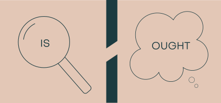
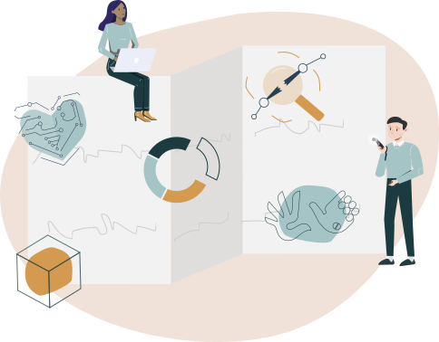
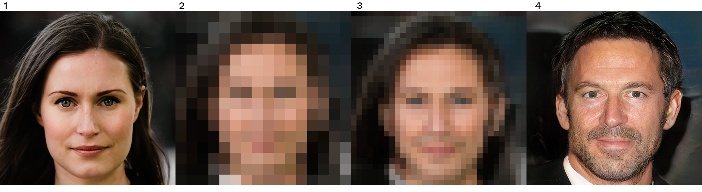
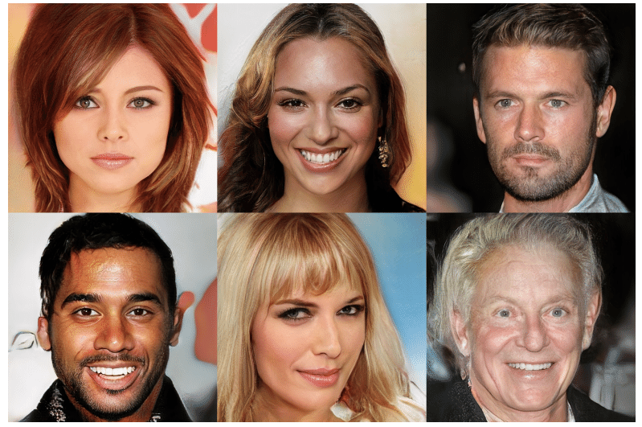

# Capítulo 1: O que é ética da IA?

::: {.nota data-titulo="Sobre este capítulo"}
**Eixo:** Conceitos

O que significa ética da IA e qual é o papel dos valores e das normas? Também
veremos os princípios da ética da IA que orientarão todo o curso.
:::

## I. Um guia para a ética da IA

Desde o nascimento da computação com Alan Turing, os seres humanos depositam
grandes esperanças no poder dos computadores e da inteligência artificial (IA).
Espera-se que a IA traga benefícios expressivos e variados à sociedade — de
mais eficiência e produtividade ao enfrentamento de uma série de problemas
globais difíceis, como mudança climática, pobreza, doenças e conflitos.

As tecnologias de IA moldam nossas sociedades. Têm um impacto enorme sobre o
cotidiano. Ao mesmo tempo, diversas questões jurídicas e sociais revelaram o
potencial dessas tecnologias de produzir efeitos indesejáveis. Algoritmos
podem intensificar vieses (*bias*) já existentes. Podem discriminar. Podem ameaçar
nossa segurança, nos manipular e ter consequências letais.

Por essas razões, é preciso examinar os aspectos éticos, sociais e jurídicos
dos sistemas de IA. Há um chamado generalizado por uma ética da IA — ou seja,
como devemos desenvolver e usar essa tecnologia de maneira eticamente
aceitável e sustentável? Quais são os princípios éticos e morais que devemos
adotar e seguir?

Neste curso, examinaremos as questões éticas relacionadas à IA contemporânea,
abriremos seus fundamentos na filosofia e daremos a elas uma interpretação nos
termos da computação e de outras ciências. O objetivo do curso é desenvolver
habilidades de pensamento ético. O curso oferece um guia — ou um roteiro —
sobre o projeto, a implementação e o uso eticamente sustentáveis da IA. Ele
apresentará conceitos éticos básicos, seu pano de fundo teórico e seu papel na
discussão sobre a IA de hoje.

::: {.tecnica data-titulo="O que é IA?"}
**Inteligência artificial** é um termo geral que descreve um conjunto de
técnicas de tipos diferentes para fazer computadores se comportarem de alguma
maneira inteligente. Não há uma definição consensual de IA, mas, de modo
geral, a capacidade de executar tarefas sem supervisão e de aprender para
melhorar o desempenho são partes centrais da IA.

**Aprendizado de máquina** (*machine learning*) é um tema importante dentro da
IA. Trata-se de um conjunto de algoritmos que aprendem por si mesmos a tomar
decisões ou a estruturar dados. O aprendizado supervisionado e o não
supervisionado baseiam-se em dados, enquanto no aprendizado por reforço o
algoritmo usa tentativa e erro para aprender a tomar sequências de decisões.
:::

## II. O que é ética da IA?

Antes de olhar para a ética da IA, precisamos estabelecer o que significa
ética, em primeiro lugar.

A ética busca responder a perguntas como "o que é bom ou mau", "o que é certo
ou o que é errado", ou "o que é justiça, bem-estar ou igualdade". Como
disciplina, a ética envolve sistematizar, defender e recomendar concepções de
conduta certa e errada por meio da
[análise conceitual](https://en.wikipedia.org/wiki/Philosophical_analysis),
de [experimentos mentais](https://plato.stanford.edu/entries/thought-experiment/)
e da [argumentação](https://iep.utm.edu/argument/). (Se você quiser saber mais
sobre raciocínio filosófico, veja este
[vídeo](https://www.youtube.com/watch?v=NKEhdsnKKHs) do canal Crash Course
Philosophy.)

::: {.filosofia data-titulo="Os três subcampos da ética"}
**1) A metaética** estuda o significado dos conceitos éticos, a existência de
entidades éticas (ontologia) e a possibilidade do conhecimento ético
(epistemologia).

**2) A ética normativa** trata dos meios práticos de determinar um curso de
ação moral (ou eticamente correto).

**3) A ética aplicada** trata daquilo que um agente moral (definido como
alguém capaz de julgar o que é certo e errado e de ser responsabilizado) é
obrigado ou tem permissão de fazer numa situação específica ou num domínio
particular de ação.
:::

A ética da IA é um subcampo da ética aplicada. Atualmente, é considerada parte
da ética da tecnologia voltada a robôs e outras entidades artificialmente
inteligentes. Ela diz respeito a como desenvolvedores, fabricantes,
autoridades e operadores devem se comportar para minimizar os riscos éticos
que podem surgir da IA na sociedade, seja pelo projeto, pela aplicação
inadequada ou pelo uso indevido intencional da tecnologia.

Essas preocupações podem ser divididas em três horizontes temporais:

* questões imediatas, do aqui e agora, sobre, por exemplo, segurança,
  privacidade ou transparência em sistemas de IA;
* preocupações de médio prazo sobre, por exemplo, o impacto da IA no uso
  militar, na atenção médica ou nos sistemas de justiça e de educação;
* preocupações de mais longo prazo sobre os objetivos éticos fundamentais do
  desenvolvimento e da implementação da IA na sociedade.

::: {.contexto data-titulo="Da ética das máquinas à ética da IA"}
Durante muito tempo, entendia-se por ética da IA sobretudo a ética das
máquinas e a roboética. Elas abrangem o estudo dos códigos éticos de agentes
morais artificiais. Como campos de pesquisa, baseiam-se num cenário em que as
máquinas poderiam, um dia, ser responsáveis por escolhas eticamente
relevantes, e até ser eventualmente consideradas agentes éticos ou agentes
morais autônomos. Em comparação, animais em geral não são considerados agentes
morais. Não julgamos o comportamento de um esquilo como certo ou errado, e não
supomos que ele tenha a capacidade de saber a diferença.

A ética das máquinas e a roboética vão do desenvolvimento de veículos
autônomos eticamente responsivos até a formulação de códigos éticos para
agentes morais autônomos.

Isaac Asimov (1942) propôs as célebres "três leis da robótica", que guiariam a
ação moral das máquinas:

- Um robô não pode ferir um ser humano ou, por omissão, permitir que um ser
  humano sofra algum mal.

- Um robô deve obedecer às ordens dadas por seres humanos, exceto quando tais
  ordens entrarem em conflito com a Primeira Lei.

- Um robô deve proteger sua própria existência, desde que essa proteção não
  entre em conflito com a Primeira ou a Segunda Lei.
:::

Hoje, a ética da IA é um campo mais geral, e mais próximo da ética da
engenharia: não precisamos supor que a máquina seja um agente ético para
analisar sua ética. A pesquisa em ética da IA vai de reflexões sobre como
princípios éticos ou morais podem ser implementados em máquinas autônomas até
a análise empírica de como problemas do bonde (*trolley problems*) são
resolvidos, a análise sistemática de princípios éticos como a equidade e a
avaliação crítica de arcabouços éticos.

## III. Valores e normas

Valores e normas são os elementos básicos da ética. O conceito de "valor"
significa, grosso modo, o grau de importância de uma coisa ou de uma ação.
Valores fornecem ideais e padrões com os quais avaliar coisas, escolhas, ações
e acontecimentos. Na ética, o foco recai principalmente sobre os valores
morais, embora outros tipos de valor — econômicos, estéticos, epistêmicos (ou
relativos ao conhecimento) — sejam por vezes moralmente relevantes. Por
exemplo, fatores econômicos podem ter papel moralmente significativo se as
decisões econômicas tiverem consequências moralmente significativas para as
pessoas.

### Valores intrínsecos e extrínsecos

Os valores podem ser divididos em **extrínsecos** (também chamados
"instrumentais") e **intrínsecos**. O dinheiro, por exemplo, tem valor
extrínseco ou instrumental. O dinheiro só é valioso porque se pode usá-lo para
outras coisas, como oferecer melhor atendimento médico às pessoas. Essas
coisas, por sua vez, podem ser boas por aquilo a que conduzem: por exemplo,
melhor saúde. E essas, por sua vez, podem ser boas apenas por aquilo a que
conduzem — por exemplo, uma melhor qualidade de vida. Coisas intrinsecamente
valiosas costumam ser os "grandes valores morais": felicidade, liberdade,
bem-estar. São coisas boas como são. Para alguns, elas também explicam a
"bondade que se encontra em todas as outras coisas" (cf. Aristóteles,
*Nicomachean Ethics*, 1094a).

### Normas

Normas são princípios, comandos e imperativos baseados em valores — como os
conjuntos de diretrizes para IA. Elas dizem o que se deve fazer, ou o que se
espera de alguém. As normas podem ser prescritivas (incentivando um
comportamento positivo; por exemplo, "seja justo") ou proscritivas (desencorajando
um comportamento negativo; por exemplo, "não discrimine").

Há vários tipos de norma:

* Algumas normas são meras regularidades estatísticas: nota-se que muitos
  cientistas da computação tendem a usar camisetas pretas.

* Algumas normas são normas sociais; dizem o que as pessoas de um grupo
  consideram ação apropriada naquele grupo.

* Normas morais são regras prescritivas ou proscritivas com força obrigatória
  que vai além da expectativa social ou estatística. Por exemplo, "não use IA
  para manipulação de comportamento" é uma norma moral.

* As normas também podem ser normas jurídicas. É importante notar que uma
  norma jurídica pode não ser uma norma moral, e vice-versa. Simplesmente, o
  fato de que "X é lei" não faz de X um princípio moral. Ao contrário, sempre
  se pode perguntar: "esta lei é moralmente aceitável ou não?"

::: {.filosofia data-titulo="A guilhotina de Hume: fatos, valores e normas"}
Afirmações normativas não descrevem como o mundo é. Em vez disso, **elas
prescrevem como o mundo deveria ser**. Ou seja, implicam avaliações do tipo
"deve-ser", em distinção a sentenças que fornecem asserções do tipo "é". Por
exemplo, a sentença "este sistema de aprendizado de máquina é um sistema
caixa-preta (*black box*)" é descritiva, ao passo que a sentença "sistemas de aprendizado de
máquina devem ser transparentes" é normativa.

É importante notar que os fatos não ditam nossas normas. Como afirma o
filósofo escocês David Hume (1711–76), não se deve fazer afirmações normativas
sobre o que deve ser com base apenas em afirmações descritivas sobre o que é.
Isso não significa que os fatos não tenham papel algum em nossa consideração
moral, mas que não se pode passar de um "é" para um "deve" sem o uso, em algum
ponto do caminho, de alguma afirmação de valor genuinamente normativa.

Esse princípio é conhecido como "guilhotina de Hume". Ele afirma que normas ou
afirmações morais não podem ser justificadas apenas por apelo a fatos. Como
observa Hume, não se pode derivar o "dever" a partir do "ser". Por exemplo, o
fato de existir um conjunto de dados enviesado não implica, por si só, que os
dados devam (ou não devam) ser enviesados. As atitudes morais dependem de
outras considerações e preferências éticas, não apenas de fatos. Por que nos
preocupamos com a questão dos dados enviesados? Ora, o problema claramente não
é o fato de existirem dados enviesados. O problema real é que os vieses podem
intensificar a discriminação.

É importante notar que a guilhotina de Hume não afirma que os fatos não
importam. Eles importam. O ponto é que os fatos, sozinhos, não resolvem
problemas éticos. Problemas éticos exigem também discussão genuinamente ética.
:::

::: {.reflexao data-titulo="Exercícios desta seção"}
O material original traz aqui três questionários interativos. As perguntas não
constam do repositório de origem — ficam no banco de dados da plataforma.
Os exercícios correspondentes devem ser redigidos em
`exercicios/capitulo01-exercicios.md`.
:::

## IV. Um arcabouço para a ética da IA

Tradicionalmente, o desenvolvimento tecnológico girou em torno da
funcionalidade, da usabilidade, da eficiência e da confiabilidade das
tecnologias. A tecnologia de IA, porém, exige uma discussão mais ampla sobre
sua aceitabilidade social. Ela incide sobre considerações morais (e
políticas). Molda indivíduos, sociedades e seus ambientes de um modo que tem
implicações éticas.

A interpretação de conceitos eticamente relevantes pode mudar com as
tecnologias (pense no que "privacidade" significava antes das redes sociais).
Além disso, quando novas tecnologias são introduzidas, os usuários com
frequência as aplicam a finalidades diferentes das originalmente pretendidas.
Isso reconfigura o panorama ético e nos obriga a refletir sobre as bases
éticas da tecnologia e analisá-las repetidamente.

### Arcabouços éticos

Arcabouços éticos são tentativas de construir consenso em torno de valores e
normas que possam ser adotados por uma comunidade — seja um grupo de
indivíduos, cidadãos, governos, empresas do setor de dados ou outras partes
interessadas.

Diversas organizações participaram do desenvolvimento de um arcabouço ético
para a IA. Naturalmente, suas visões diferem em alguns aspectos, mas também
emergiu um consenso entre elas. Segundo um estudo recente (Jobin et al., 2019),
a ética da IA convergiu de forma bastante rápida para um conjunto de cinco
princípios:

* não-maleficência
* responsabilidade ou responsabilização (*accountability*)
* transparência e explicabilidade
* justiça e equidade
* respeito a diversos direitos humanos, como privacidade e segurança

Os cinco princípios da ética da IA respondem a perguntas diferentes e se
concentram em valores diferentes:

1. Devemos usar a IA para o bem e não para causar dano? (princípio da
   beneficência / não-maleficência)
2. Quem deve ser responsabilizado quando a IA causa dano? (princípio da
   responsabilização)
3. Devemos compreender o que a IA faz e por que faz? (princípio da
   transparência)
4. A IA deve ser justa ou não discriminatória? (princípio da equidade)
5. A IA deve respeitar e promover os direitos humanos? (princípio do respeito
   aos direitos humanos básicos)

O restante deste curso se concentrará nesses princípios da ética da IA.
Analisaremos o que esses conceitos implicam e como podem ser interpretados, ao
modo da filosofia tradicional: análise conceitual. Também veremos como esses
conceitos vêm sendo aplicados na prática, discutiremos seus problemas e
mencionaremos algumas questões em aberto a respeito deles.

Na última parte do curso, olharemos para o projeto da ética da IA como um
todo. Faremos a pergunta *cui bono*: a ética da IA é para quem, e quem ou o
que fica de fora?

Por fim, queremos observar que, quando se fala de IA e implicações sociais, a
ética da IA é a primeira da lista. Mas existem outros quadros teóricos para
examinar códigos éticos de sistemas algorítmicos orientados a dados. Por
exemplo, questões sobre as implicações sociais da IA aparecem em campos como
culturas algorítmicas, estudos de gênero e estudos de mídia, entre muitos
outros. Da mesma forma, os aspectos cognitivos e psicológicos da interação
humano-máquina moldam a questão do arcabouço ético apropriado para a IA. Em
suma, há muito mais na ética da IA do que apenas ética de dados ou de
algoritmos.

::: {.reflexao data-titulo="Exercícios desta seção"}
O material original traz aqui um questionário interativo sobre os cinco
princípios da ética da IA apresentados nesta seção, avaliado por revisão por
pares na plataforma Open edX. As perguntas não constam do repositório de
origem — ficam no banco de dados da plataforma. Redija o exercício
correspondente em `exercicios/capitulo01-exercicios.md`.
:::

### Estudo de caso: tradução de imagens e o que ela reproduz

::: {.caso data-titulo="Uma discussão no Twitter"}
Imagine que um dia você acabe numa discussão acalorada no Twitter. Ela começa
com o tuíte de um professor universitário (@TuringLives) sobre um modelo de
tradução de imagens. O modelo transformou uma imagem de entrada pixelada da
primeira-ministra finlandesa Sanna Marin na foto de um homem branco de meia-idade:

**Observação:** este não é um caso real de recriação fotográfica por IA.

Imagem 1: CC BY 4.0 Laura Kotila / Gabinete da Primeira-Ministra da Finlândia
(editada a partir do original). Imagens 2 e 3 são uma impressão artística.
Imagem 4: CC BY-NC 4.0 NVIDIA Corporation.
:::

**O que são algoritmos de tradução de imagens?**

Muitos dos exemplos mais conhecidos de tradução de imagens são produzidos por
uma rede generativa adversarial (*Generative Adversarial Network*, GAN). Uma
GAN é um tipo de arquitetura de rede neural voltada à modelagem generativa.

Nas GANs, duas redes competem entre si. Uma delas é treinada para gerar, por
exemplo, imagens semelhantes às dos dados de treinamento (gatos, rostos
humanos ou outras coisas). A tarefa da outra rede (chamada rede adversarial) é
separar as imagens geradas pela primeira das imagens reais dos dados de
treinamento.

O sistema treina os dois modelos lado a lado. Na primeira fase do treinamento,
a tarefa do modelo adversarial é distinguir as imagens reais dos dados de
treinamento das tentativas desajeitadas do modelo generativo. Contudo, à
medida que a rede generativa vai lentamente melhorando, o modelo adversarial
também precisa melhorar. O ciclo continua até que, por fim, as imagens geradas
sejam quase indistinguíveis das reais. (Para mais informações sobre GANs,
veja o curso online *Elements of AI*.)

As GANs não tentam apenas reproduzir os itens dos dados de treinamento. O
sistema é treinado de modo a ter de gerar itens novos e de aparência real,
como imagens. No entanto, as GANs — como muitos outros algoritmos
contemporâneos — produzem resultados que refletem os padrões estatísticos dos
dados de entrada.

Essas imagens foram desenvolvidas num projeto de pesquisa de Tero Karras,
Samuli Laine, Timo Aila e Jaakko Lehtinen no NVIDIA Research Helsinki
([veja este artigo para mais informações](https://research.aalto.fi/en/publications/progressive-growing-of-gans-for-improved-quality-stability-and-va)).

As GANs podem ser usadas para muitos fins, como tarefas de tradução de
imagem para imagem — converter fotos de noite em fotos de dia — ou gerar fotos
fotorrealistas de itens, objetos, cenas ou pessoas.

Para ver como as GANs funcionam, acesse:
http://gandissect.res.ibm.com/ganpaint.html

A seguir, você vai entrar na discussão do Twitter. Sua tarefa é responder a
esses tuítes formulando sua própria opinião sobre o assunto.

Como você responderia? Desenvolva um nome de usuário no Twitter para si
mesmo e escreva sua resposta abaixo.

::: {.reflexao data-titulo="Exercícios desta seção"}
No material original, o estudo de caso termina com uma tarefa dissertativa:
entrar na discussão do Twitter, desenvolver um nome de usuário para si mesmo
e responder ao tuíte do professor (@TuringLives) sobre a transformação da
imagem de Sanna Marin, formulando sua própria posição sobre o assunto. Redija
a versão em português desse exercício em
`exercicios/capitulo01-exercicios.md`.
:::

## Referências

Jobin, A., Ienca, M., & Vayena, E. (2019). The global landscape of AI ethics
guidelines. *Nature Machine Intelligence*, 1(9), 389–399.

Asimov, I. (1942). Runaround. *Astounding Science Fiction*.

Hume, D. (1739–40). *A Treatise of Human Nature*.

Aristóteles. *Nicomachean Ethics*, 1094a.

Karras, T., Laine, S., Aila, T., & Lehtinen, J. (2018). Progressive Growing of
GANs for Improved Quality, Stability, and Variation. *ICLR 2018*.

---

::: licenca
**Material original:** *Ethics of AI*, um curso online gratuito da
Universidade de Helsinque. Professores responsáveis: Anna-Mari Rusanen e
Jukka K. Nurminen. Demais contribuintes principais: Santeri Räisänen, Sasu
Tarkoma e Saara Halmetoja. Disponível em <https://ethics-of-ai.mooc.fi/>.

**Esta versão:** tradução e adaptação para o português brasileiro realizada
por José Lucas Lira Bizil, Fernando Mazzeto Lisboa Lima e Matheus da Silva Fernandes, no âmbito do Programa CiberExt 26-29 (FEELT38103),
Universidade Federal de Uberlândia, 2026. Esta é uma obra derivada; os autores
originais não a revisaram nem a endossam.

**Licença:** Creative Commons Atribuição-NãoComercial-CompartilhaIgual 4.0
Internacional (CC BY-NC-SA 4.0) —
<https://creativecommons.org/licenses/by-nc-sa/4.0/deed.pt-br>.
:::
