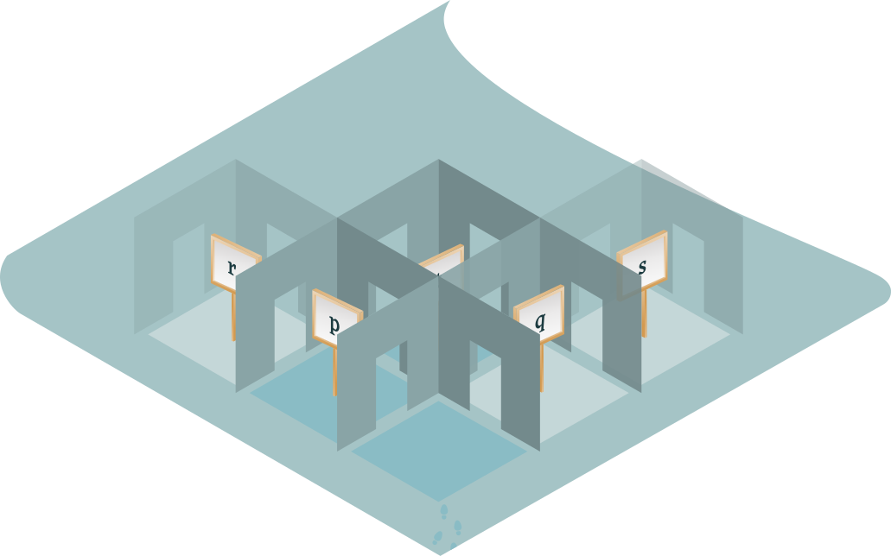
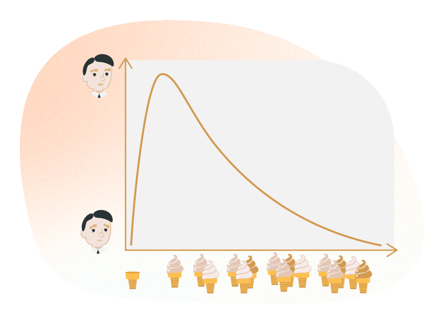

# Capítulo 2: Não-maleficência — o que devemos fazer?

::: {.nota data-titulo="Sobre este capítulo"}
**Eixo:** Conceitos e Riscos

O que significa "fazer o bem" e "não causar dano" quando falamos de IA? Este
capítulo apresenta o utilitarismo — uma das respostas filosóficas clássicas
para a pergunta sobre o bem comum — e também seus limites.
:::

## I. O que devemos fazer?

### O princípio da beneficência

> *"A IA inevitavelmente se enreda nas dimensões éticas e políticas das
> vocações e práticas em que está inserida. A ética da IA é, na prática, um
> microcosmo dos desafios políticos e éticos enfrentados pela sociedade."*
>
> <cite>Brent Mittelstadt</cite>

O princípio da **beneficência** diz "faça o bem", enquanto o princípio da
**não-maleficência** afirma "não cause dano". Embora esses dois princípios
possam parecer semelhantes, representam princípios distintos. A beneficência
incentiva a criação de uma IA benéfica ("a IA deve ser desenvolvida para o bem
comum e o benefício da humanidade"), ao passo que a não-maleficência diz
respeito às consequências negativas e aos riscos da IA.

De modo geral, a ética da IA tem se ocupado principalmente do princípio da
não-maleficência. A discussão concentrou-se sobretudo em como
desenvolvedores, fabricantes, autoridades e outras partes interessadas devem
minimizar os riscos éticos — discriminação, proteção da privacidade, danos
físicos e sociais — que podem surgir de aplicações de IA. Com frequência,
essas discussões são formuladas em termos de uso indevido intencional, invasão
maliciosa, medidas técnicas ou estratégias de gestão de risco.

::: {.filosofia data-titulo="O solucionismo tecnológico"}
Críticos afirmam que a ênfase na não-maleficência transforma a ética numa
questão de encontrar soluções técnicas para problemas técnicos. Os problemas
morais passam a ser vistos como coisas que podem ser resolvidas por "consertos"
técnicos, ou apenas por um bom projeto. Esquece-se o contexto ético e social
mais amplo em que os sistemas técnicos estão inseridos. Muitas questões
importantes que orientam o controle, a governança e as dimensões sociais da IA
são ignoradas.

O pesquisador de tecnologia Evgeny Morozov chama isso de "solucionismo
tecnológico" (*tech solutionism*) — a convicção de que problemas causados pela
tecnologia sempre podem ser resolvidos com mais tecnologia.
:::

Como resultado, problemas éticos profundos e difíceis são simplificados
demais e ficam sem resposta. Uma dessas questões é o problema do "bem comum".
O que exatamente isso significa? Neste capítulo, examinaremos uma resposta
filosófica clássica.

## II. O bem comum — calculando consequências

*Ilustração. © Keksi Agency via Cidade de Helsinque / Comunicação*

Suponha que você seja o diretor digital (*Chief Digital Officer*) da cidade de
Helsinque. Pedem que você avalie se a organização de saúde da cidade deveria
migrar de uma saúde "reativa" para uma saúde "preventiva". Você lê um
relatório. Ele fala de sistemas de aprendizado de máquina (*machine learning*) novos e sofisticados
que ajudariam as autoridades de saúde a prever os possíveis riscos de saúde dos
cidadãos.

Esses métodos produzem previsões combinando e analisando diversas fontes de
dados médicos e de sistemas de saúde. Analisando um grande número de critérios,
indivíduos de alto risco poderiam ser identificados e priorizados. Essas
pessoas poderiam ser convidadas proativamente a uma consulta médica para
receber o tratamento adequado.

**Os benefícios**

O relatório menciona muitas vantagens. Por exemplo, a prevenção de doenças tem
grande potencial de melhorar a saúde e a qualidade de vida dos cidadãos. Além
disso, permitiria melhor estimativa de impacto e melhor planejamento dos
serviços básicos de saúde. A saúde preventiva também tem potencial de reduzir
significativamente os custos sociais e de saúde. Essas economias, enfatiza o
relatório, poderiam ser usadas para o bem comum.

**Os problemas potenciais**

O relatório, porém, também traz algumas preocupações. Por exemplo, os sistemas
levantam uma série de questões jurídicas e éticas relativas à privacidade, à
segurança e ao uso dos dados. O relatório pergunta, por exemplo: onde fica a
fronteira entre prevenção aceitável e intrusão inaceitável? A cidade tem
direito de usar dados médicos privados e sensíveis para identificar pacientes
de alto risco? Como deve ser dado o consentimento, e o que acontecerá com as
pessoas que não o derem? E quanto às pessoas que não dão consentimento porque
não são capazes de fazê-lo?

O relatório levanta ainda a questão fundamental do papel da cidade: se a cidade
tem informação sobre um risco potencial de saúde e não age sobre esses dados,
a cidade é culpada de negligência? Os cidadãos são tratados igualmente nos
mundos físico e digital? Se uma pessoa desmaia na vida real, chamamos uma
ambulância sem ter permissão explícita para isso. No mundo digital,
preocupações com privacidade podem nos impedir de contatar os cidadãos.

O que você acha do exemplo acima? Como diretor digital, você promoveria o uso
de métodos preventivos? Se sua resposta for algo como "sim, a cidade deveria
buscar uma forma ética e juridicamente aceitável de usar esses métodos — há
tantas vantagens em comparação com os possíveis riscos", você provavelmente
estava usando uma forma de raciocínio moral chamada "utilitarismo".

::: {.definicao data-titulo="Utilitarismo"}
**Utilitarismo** é uma família de teorias éticas. Ela concebe "benefícios" como
ações que maximizam o bem-estar de todos os indivíduos afetados. O utilitarismo
é uma versão do consequencialismo, que afirma que as consequências de qualquer
ação são os únicos padrões do certo e do errado.
:::

Segundo os utilitaristas, as ações moralmente corretas são aquelas que produzem
o maior saldo de benefícios sobre danos para todos os afetados. Diferentemente
de outras formas mais individualistas de consequencialismo (como o egoísmo) ou
de consequencialismos com pesos desiguais (como o prioritarismo), o
utilitarismo considera igualmente os interesses de todos os seres humanos.
Contudo, os utilitaristas divergem em muitas questões específicas, como saber
se as ações devem ser escolhidas com base em seus resultados prováveis
(utilitarismo de ato) ou se os agentes devem se conformar a regras que
maximizem a utilidade (utilitarismo de regra). Há também divergência sobre se
deve ser maximizada a utilidade total (utilitarismo total), a média
(utilitarismo médio) ou a mínima.

Para os utilitaristas, a utilidade — ou benefício — é definida em termos de
bem-estar ou felicidade. Por exemplo, Jeremy Bentham, o pai do utilitarismo,
caracterizou a utilidade como "aquela propriedade [...] que tende a produzir
benefício, vantagem, prazer, bem ou felicidade [...] ou a impedir que ocorram
dano, dor, mal ou infelicidade à parte cujo interesse está sendo considerado."

O utilitarismo oferece um método relativamente simples para decidir se uma ação
é moralmente correta ou não. Para descobrir o que devemos fazer, seguimos estes
passos:

* primeiro, identificamos as várias ações que poderíamos realizar;
* segundo, estimamos os benefícios e os danos que resultariam de cada ação;
* terceiro, escolhemos a ação que oferece os maiores benefícios depois de
  considerados os custos.

O utilitarismo fornece muitas ideias e conceitos interessantes. Por exemplo, o
princípio da "utilidade marginal decrescente" é útil para diversos fins.
Segundo esse princípio, a utilidade de um item diminui à medida que a oferta de
unidades aumenta (e vice-versa).

Por exemplo, quando você começa a se exercitar, no início o benefício é grande
e seus resultados melhoram dramaticamente. Mas quanto mais tempo você continua
treinando, menor o impacto de cada sessão individual. Se você treina demais, a
utilidade diminui e você começa a sofrer com os sintomas de excesso de treino.

Outro exemplo: se você come uma bala, terá bastante prazer. Mas se comer balas
demais, pode ganhar peso e aumentar o risco de todo tipo de doença. Esse
paradoxo dos benefícios deve ser sempre lembrado quando avaliamos as
consequências das ações. O que é o bem comum agora pode não ser o bem comum no
futuro.

## III. Os problemas do utilitarismo

O utilitarismo não é uma explicação perfeita da tomada de decisão moral. Ele
foi criticado sob muitos aspectos. Por exemplo, o cálculo utilitarista exige
que atribuamos valores aos benefícios e danos resultantes de nossas ações e os
comparemos com as consequências que poderiam resultar de outras ações. Mas
frequentemente é difícil, senão impossível, medir e comparar antecipadamente os
valores de todos os benefícios e custos relevantes.

"Risco" é comumente usado para significar a probabilidade de um perigo ou
ameaça que surge de modo imprevisível ou, num sentido mais técnico, a
probabilidade de determinado grau de dano. Na ética da IA, entende-se que danos
e riscos surgem do projeto, da aplicação inadequada ou do uso indevido
intencional da tecnologia. Exemplos típicos são riscos como discriminação,
violação de privacidade, questões de segurança, guerra cibernética ou invasão
maliciosa. Na prática, é difícil comparar riscos e benefícios pelas seguintes
razões:

**Primeira:** riscos e benefícios são influenciados por compromissos de valor,
preferências subjetivas e diversas, circunstâncias práticas e fatores pessoais
e culturais.

**Segunda:** danos e benefícios não são estáticos. A utilidade marginal de um
item diminui de um modo que pode ser difícil de prever. Além disso, um dano
específico ou um benefício específico pode ter valor de utilidade diferente em
circunstâncias diferentes. Por exemplo, se um carro mais rápido será ou não
mais benéfico depende do uso pretendido — se a intenção é que seja um ônibus
escolar, devemos priorizar a segurança; se for usado como carro de corrida, a
resposta pode ser outra.

**Terceira:** as situações do mundo real costumam ser tão complexas que é
difícil prever ou comparar antecipadamente todos os riscos e benefícios. Por
exemplo, analisemos as possíveis consequências da robótica militar. Embora os
robôs militares contemporâneos sejam em grande parte operados remotamente ou
semiautônomos, com o tempo é provável que se tornem totalmente autônomos.
Segundo algumas estimativas, os robôs reduzem as baixas civis e militares. Mas,
segundo outras, eles não reduzem o risco para os civis. Estatisticamente, nas
primeiras décadas de guerra do século XXI, armamentos robóticos estiveram
envolvidos em numerosas mortes tanto de soldados quanto de não combatentes. A
possibilidade de usar diversas técnicas — como *adversarial patches* (adesivos
adversariais, que interrompem a capacidade de uma máquina de classificar
imagens corretamente) — para enganar e manipular armas automatizadas complica a
situação ao aumentar o risco específico de causar dano a civis. O nível geral
de risco também depende da facilidade com que guerras poderiam ser declaradas
caso os robôs assumam a maior parte do risco físico.

**Quarta:** o utilitarismo não leva em conta outros aspectos morais. É fácil
imaginar situações em que uma tecnologia desenvolvida produziria grandes
benefícios para as sociedades, mas cujo uso ainda assim levantaria questões
éticas importantes. Por exemplo, pensemos no caso de um sistema de saúde
preventiva. O sistema pode de fato ser benéfico para muitos, mas ainda nos
obriga a perguntar se direitos humanos fundamentais, como a privacidade,
importam. Ou o que acontece com o direito do cidadão de *não* saber sobre
possíveis problemas de saúde? (Muitos de nós gostaríamos de saber se estamos
num grupo de alto risco, mas e se alguém não quiser saber? Pode uma cidade
impor esse conhecimento a essa pessoa?) Ou ainda: como garantir que todos
tenham acesso igual aos possíveis benefícios de um sistema preventivo?

::: {.filosofia data-titulo="O monstro de utilidade de Nozick"}
Uma das maiores dificuldades do utilitarismo é a questão da utilidade: o que
ela é, afinal? Tecnicamente, utilidade é apenas uma medida (uma quantidade
numérica) que descreve algum tipo de "bem" subjacente que queremos maximizar.
Digamos, prazer ou bem-estar (que filósofos hedonistas afirmariam ser a mesma
coisa). O prazer é, ao menos em certa medida, uma experiência subjetiva, e a
utilidade, como medida, deveria transformá-lo num número comparável entre
sujeitos. Essa é uma exigência elevada.

Supondo que tal medida de utilidade de fato exista, o filósofo Robert Nozick
apresenta o seguinte enigma. Existe uma criatura chamada Monstro de Utilidade.
Sua mente hedonista é constituída de tal forma que, dado qualquer recurso, ela
obtém dele mais prazer do que qualquer outro indivíduo obteria. Ela
simplesmente aprecia maçãs, carros, café, liberdade etc. mais do que qualquer
outra pessoa. Isso significa que ela extrai mais utilidade dessas coisas, e se
somos moralmente obrigados a maximizar a utilidade produzida pelos recursos que
temos, a conclusão é clara: tudo o que temos vai para o Monstro de Utilidade.
Nada para mais ninguém.

Isso torna o utilitarismo indefensável? Existe algum modo de o utilitarista
argumentar que o enigma proposto por Nozick não é realmente um problema?
:::

::: {.reflexao data-titulo="Exercícios desta seção"}
O material original traz aqui um questionário interativo. As perguntas não
constam do repositório de origem — ficam no banco de dados da plataforma. O
exercício correspondente deve ser redigido em
`exercicios/capitulo02-exercicios.md`.
:::

## IV. Bem comum e bem-estar

Apesar dos problemas descritos na seção anterior, os princípios do utilitarismo
podem nos ajudar a considerar as consequências imediatas e as menos imediatas
de nossas ações. Convém lembrar que, na vida real, definir o "bem comum" exige
uma diversidade de pontos de vista.

::: {.filosofia data-titulo="O que é bem-estar?"}
Com frequência, o termo "bem comum" é tomado como sinônimo de "bem-estar". Mas
o que é bem-estar? As raízes da pesquisa sobre bem-estar estão na Grécia
antiga, onde filósofos como Aristóteles se concentravam em como alcançar "a boa
vida". Desde então, a busca pela boa vida tem sido tema constante em diferentes
disciplinas. Hoje, a pesquisa em campos como psicologia, economia e ciências
sociais aborda o bem-estar em termos "das dimensões biológica, pessoal,
relacional, institucional, cultural e global da vida". Essas dimensões abrangem
fatores como vitalidade física e mental, satisfação social e senso de
realização e plenitude pessoal.

Os estudos sobre bem-estar podem ser divididos em três subtipos principais:

**1) As teorias subjetivas.** Concentram-se em questões como o modo que as
pessoas se sentem ao longo da vida cotidiana, ou como uma pessoa avalia a
própria vida. Esse tipo de bem-estar psicológico é frequentemente descrito como
a experiência de alta satisfação com a vida, altos níveis de emoções e humores
agradáveis e baixos níveis de emoções e humores negativos.

**2) As teorias eudaimônicas.** Consideram o bem-estar principalmente como
resultado da busca de objetivos positivos. A perspectiva eudaimônica diferencia
o bem-estar da satisfação do desejo. Segundo essas teorias, bem-estar e
felicidade subjetiva não devem ser equiparados, porque os resultados
produtores de prazer que fundamentam a felicidade subjetiva não necessariamente
promovem saúde e bem-estar. Em vez disso, entende-se que o bem-estar requer
componentes como autonomia, domínio do ambiente, crescimento pessoal, relações
positivas com os outros, senso de propósito na vida e autoaceitação. Essas
dimensões descrevem o bem-estar como uma avaliação globalmente positiva de si
mesmo, a aceitação da própria história de vida e dos talentos individuais como
membro de uma comunidade, a crença de que a própria vida é significativa e um
senso de autodeterminação.

**3) As teorias sociais.** Nelas, o bem-estar é abordado em termos de fatores
sociais, como integração, contribuições à vida social, coerência social e
aceitação social. O bem-estar depende do grau em que um indivíduo funciona bem
em seus ambientes sociais.

Hoje, muitas das abordagens do bem-estar combinam elementos de todas essas
teorias. O bem-estar é visto como uma combinação complexa de aspectos
psicológicos, sociais e físicos, e adota uma perspectiva de qualidade de vida
como um todo.

Pesquisas como o *World Happiness Report* são exemplos dessa abordagem
holística. O relatório é uma publicação anual da Rede de Soluções para o
Desenvolvimento Sustentável das Nações Unidas. Contém artigos e classificações
de felicidade nacional baseadas na avaliação que os respondentes fazem da
própria vida, que o relatório também correlaciona com diversos fatores de vida.
(Até março de 2020, a Finlândia foi classificada como o país mais feliz do
mundo três vezes seguidas.)

Além disso, pesquisadores desenvolvem constantemente novas maneiras de abordar
o bem-estar. Por exemplo, os grandes volumes de dados (*big data*) são hoje utilizados de muitas formas na
pesquisa sobre bem-estar. Os métodos contemporâneos incluem a análise mais
avançada de dados demográficos e socioeconômicos, mas também, por exemplo, o
uso de ferramentas de mineração de texto em documentos escritos — como
publicações no Twitter, no Facebook ou outros dados de redes sociais —, além da
análise de pegadas digitais e até de traços faciais.
:::

A abordagem do bem comum exige que todos tenham acesso aos benefícios da IA.
Isso destaca a importância de assegurar que os benefícios potenciais da IA não
se acumulem de forma desigual e sejam tornados acessíveis ao maior número
possível de pessoas. Além disso, a IA deve estar alinhada a valores, objetivos
e normas, respeitando em grau suficiente a diversidade cultural e individual.

O bem comum não é um singular, mas um plural. Identificar as normas sociais e
morais da comunidade específica em que uma IA será implantada é, portanto,
obrigatório. É o único caminho para levar à sociedade os benefícios
potencialmente significativos e diversos da IA e para promover, entre outras
coisas, maior bem-estar e assistência social para todos.

::: {.reflexao data-titulo="Exercícios desta seção"}
O material original traz aqui dois questionários interativos. As perguntas não
constam do repositório de origem. Os exercícios correspondentes devem ser
redigidos em `exercicios/capitulo02-exercicios.md`.
:::

## Referências

Bentham, J. (1789). *An Introduction to the Principles of Morals and
Legislation*.

Mittelstadt, B. (2019). Principles alone cannot guarantee ethical AI. *Nature
Machine Intelligence*, 1, 501–507.

Morozov, E. (2013). *To Save Everything, Click Here: The Folly of
Technological Solutionism*. PublicAffairs.

Nozick, R. (1974). *Anarchy, State, and Utopia*. Basic Books.

*World Happiness Report*. UN Sustainable Development Solutions Network.
<https://worldhappiness.report/>

---

::: licenca
**Material original:** *Ethics of AI*, um curso online gratuito da
Universidade de Helsinque. Professores responsáveis: Anna-Mari Rusanen e
Jukka K. Nurminen. Demais contribuintes principais: Santeri Räisänen, Sasu
Tarkoma e Saara Halmetoja. Disponível em <https://ethics-of-ai.mooc.fi/>.

**Esta versão:** tradução e adaptação para o português brasileiro realizada
por José Lucas Lira Bizil, Fernando Mazzeto Lisboa Lima e Matheus da Silva Fernandes, no âmbito do Programa CiberExt 26-29 (FEELT38103),
Universidade Federal de Uberlândia, 2026. Esta é uma obra derivada; os autores
originais não a revisaram nem a endossam.

**Licença:** Creative Commons Atribuição-NãoComercial-CompartilhaIgual 4.0
Internacional (CC BY-NC-SA 4.0) —
<https://creativecommons.org/licenses/by-nc-sa/4.0/deed.pt-br>.
:::
