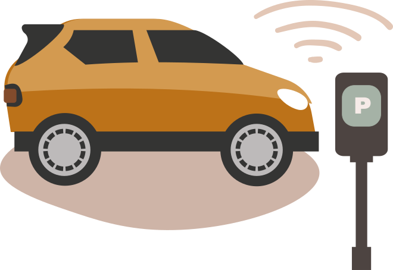
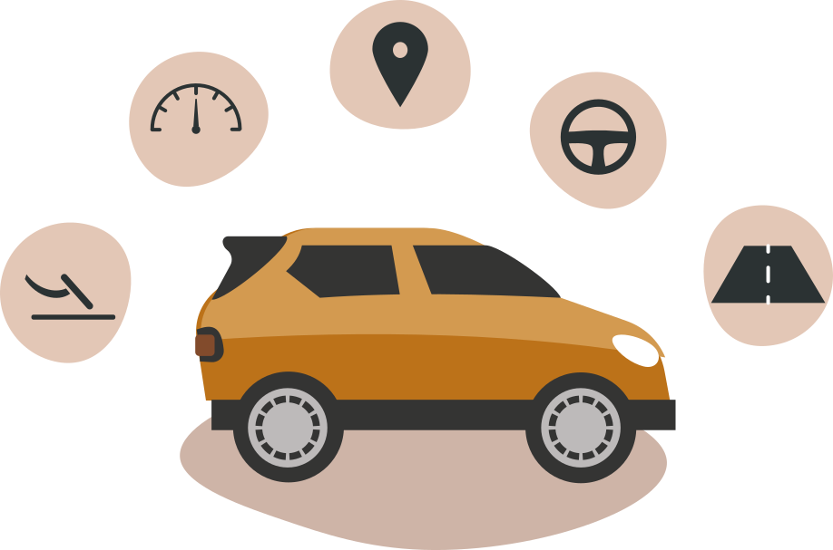
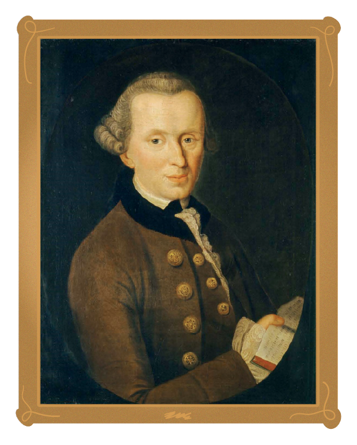

## Algorithms and accountability

::: {.tecnica}

In the city of Amsterdam,  parking control is partially automated and in use across 150,000 street parking spaces in the city. The service follows a three step process:

1) Scan cars equipped with cameras drive through the city and use object recognition software to scan and identify the license plates of surrounding cars.

2) After identification, the license plate number is checked against the National Parking Register to validate if the car has permission to park at a given location. Whenever no payment has been made for current parking, the case is sent to a human inspector for further processing.

3) A parking inspector uses the scanned images to remotely assess whether there is a special situation such as loading or unloading, or stationary cars in front of a traffic light. The parking inspector may also verify the situation on-site by scooter. Whenever there is no valid reason for non-paid parking, a parking ticket is issued.

  

  

  </img>

:::

Parking control services provide an example of how algorithms are increasingly used for automating public services.  As algorithms are exact, fast and precise, they often promote better service efficiency, reliability and consistency.  Paradoxically, algorithms can also make systematic errors, be biased and cause serious harms. For example, scanning systems may malfunction, or suffer from bugs. They may make mistakes and suggest the tickets be issued on invalid grounds. In these cases, who should take the responsibility – and on what grounds?

Although we say things like "yes, it was the algorithm’s fault and it is responsible for the wrong decision", we do not literally mean that contemporary algorithms would be morally guilty. Instead, the algorithms are causal factors that underlie the decisions. Mere causes, however, differ from morally responsible actions.

Even though algorithms themselves cannot be held accountable as they are not moral or legal agents, the organizations designing and deploying algorithms can be taken to be morally responsible through governance structures. Thus, in the case of the city of Amsterdam, it is the human inspector that makes the final decision – and also takes responsibility. However, one day the human inspector may be replaced by algorithms, too. Who, then, will take responsibility?

::: {.tecnica data-titulo="Automated vs. autonomous decision making"}

**Automated systems** typically run within a well-defined set of parameters and are very restricted in what tasks they can perform. The decisions made or actions taken by an automated system are based on predefined heuristics or rules.

**An autonomous system** learns and adapts to dynamic environments, and evolves as the environment around it changes. The data  it learns and adapts to may be outside what was considered when the system was deployed.

Automation or autonomisation is about degree, and hence, they are continuums rather than simple yes/no situations. For example, a system can be said to be autonomous with respect to human control to a certain degree.

  

  

  

:::

## What is accountability?

Accountability means the state of being responsible or answerable for a system, its behavior, and its potential impacts. Accountability is an acknowledgement of responsibility for actions, decisions, and products.

Responsibility can be legal or moral (ethical). **Legally**, an actor is responsible for an event when a legal system is liable to penalise that actor for that event. **Morally**, an actor is responsible for an act, if they can be blamed for the action. Moral and legal responsibility are different things. They do not always coincide; an agent can be legally responsible even if they were not morally responsible, and vice versa.  In this course, we´ll focus only on moral aspects of responsibility.

In AI ethics, there are three different senses or dimensions of accountability. They point to a different means of action including:

* The question of determining the responsibility – which individuals (or groups) are accountable for the impact of algorithms or AI? Who is responsible for what effect within the overall socio-technical system?
* A feature of the societal  system that develops, produces,  and uses AI
* A feature of the AI system itself

## Who should be blamed – and for what?

In ethics, accountability is closely related to the concept of “moral agency”. A moral agent is “an agent who is capable of acting with reference to right and wrong." Importantly, only moral agents are morally responsible for their actions.

**Actions and omissions**

Philosophically, a moral agent is primarily responsible for their own actions (“acts”). Sometimes agents are also responsible for not-doings, “omissions”. So, if I kill someone, I am responsible for that act. If I just let someone die, I am responsible for not-helping (omission), even if I did not actively kill someone.

Omissions and actions are not morally equal. It is morally less bad to omit a thing than to perform an act: It is worse to actively kill someone than to let them die. But this doesn’t make omissions morally right. However, we cannot be responsible for all of the things we do not do. Instead, we are responsible for only those things which we’ve deliberately and knowingly chosen to do or omit.

**Autonomy**

Philosophically, moral responsibility requires 1) moral autonomy and 2) the ability to evaluate the consequences of actions. “Moral autonomy” means the agent’s capacity to impose the moral code on oneself in a self-governed way.  Further, autonomy requires:

* The capacity to rule oneself without manipulation by others and the ability to act, without external or internal constraints
* The authenticity of the desires (values, emotions, etc) that move someone to act
* Sufficient cognitive skills – meaning an agent must be able to evaluate, to predict and to compare consequences of their actions and, also, to estimate motives that drive action by using ethically meaningful criteria

::: {.filosofia data-titulo="Moral responsibility"}

Immanuel Kant is one of the most famous European moral philosophers. For Immanuel Kant, practical reason — our ability to use reasons to choose our own actions — presupposes that we  are free. Actions are based on our own will to utilize a moral law to guide our decisions. For Kant, and Kantians, the claim is that this capacity (to impose the moral law upon ourselves) is the ultimate source of all moral value.

So, according to Kant, we owe ourselves moral respect in virtue of our autonomy. But we owe similar respect to all other persons in virtue of their capacity. Hence (via the second formulation of Kant’s famous Categorical Imperative), we are obliged to act out of fundamental respect for other persons in virtue of their autonomy. In this way, autonomy serves as both a model of practical reason in the determination of moral obligation and as the feature of other persons who deserve moral respect from us. (For further discussion, see [Immanual Kant and moral philosophy](https://en.wikipedia.org/wiki/Categorical_imperative).)

 </img>

:::

::: {.reflexao data-titulo="Questionário do original"}
O material original traz aqui um questionário interativo (id `63998353`). As perguntas não constam do repositório — ficam no banco de dados da plataforma. Redija o exercício correspondente em `exercicios/`.
:::

## The problem of individuating responsibilities

Accountability is often taken as a legal and ethical obligation on an individual or organisation to accept responsibility for the use of AI systems, and to disclose the results in a transparent manner. This formulation presupposes a “power-relation”. It individuates who is in control and who is to be blamed.

However, it has turned out to be notoriously difficult to set specific criteria on how, exactly, the responsibilities should be individuated, directed and defined. In many countries, there are on-going debates on these questions. International actors, such as European Union and G7 have addressed them as  open challenges.

Why is it so difficult to set criteria on who is responsible?

* **Firstly**, the quality of responsibilities differ. An actor is responsible for a specific action or omission, but the quality of responsibility is dependent on the stakeholder. Thus, although by choosing an action you may commit the responsibility, the quality of responsibility is dependent also on your properties. Intelligent technologies complicate this more.

    As we delegate more and more decision making tasks and functions to algorithms, we also shape decision making structures. AI is augmenting our intelligence by giving us more computational power, allowing better predictions and enhancing our sensory apparatus. Human and machines become cognitive hybrids.  They cooperate cognitively (thinking) and epistemically (knowledge), both at the individual and collective level. This creates systemic properties.

    It is often thought that it is sufficient that a human stays “in-the-loop” or “on-the-loop” – meaning at  some point of decision making, a human individual would be able to monitor or intervene in the artificial system. However, as algorithms enter into decision making, say, in public sector governance, the collective decision making can take a very complex and highly distributed form. To individuate and address the factors in a way that would guarantee that a human stays in/on-the-loop may be really difficult.

* **Secondly**, technology can also take the persuasive form: it influences and controls people.  A classical example is the beeping sound of seat belts. In many cars, if the seat belts are not fastened, it will cause a constant beeping sound. This can be taken as a form of controlling influence—in this case a kind of coercion. The driver can only stop the sound by fastening the belt. Contemporary algorithmic applications can have more and more such features; they propose, suggest and limit the options.

    But, an action is done voluntarily only if the action is done intentionally (the one acting is “in control”) and is free from controlling influences. Is the driver free from controlling influences, if the seat belt system forces him to react to the beeping sound? Or, are we free from control, if the algorithms decide whose pictures we´ll see in the dating sites, or what music we are about to listen to? What, exactly, is the difference between algorithmic suggestion, control, or manipulation?

    Naturally, persuasive technology should comply with the requirement of voluntariness to guarantee autonomy. Algorithms complicate this issue, since the voluntariness presupposes a sufficient understanding of the use of specific technology. But, what does it mean to “understand”, and what is the sufficient degree, really? What is the correct reading of “understandability” – “transparency”, “explainability” or  “auditability”? How much, and what, exactly, a user should understand about the technology? When can one genuinely  estimate, whether or not they want to use that particular technology? We’ll look at this topic in more detail in chapter 4.

::: {.reflexao data-titulo="Questionário do original"}
O material original traz aqui um questionário interativo (id `b6f98b77`). As perguntas não constam do repositório — ficam no banco de dados da plataforma. Redija o exercício correspondente em `exercicios/`.
:::

 </img>

Picture © City of Helsinki / Communications

  

  

Let’s return to the case of healthcare in Helsinki (as mentioned at the start of chapter 2). Suppose you are the Chief Digital Officer in Helsinki City. You are asked to consider whether the city’s healthcare organization should move from reactive healthcare to preventive healthcare. You read a report. It discusses novel machine learning-based methods, which would help health authorities to forecast the possible health risks of citizens.

The report mentions many advantages, such as sickness prevention, better impact estimation, and better planning of basic healthcare services. However, the report also reveals some concerns over privacy, polarization, and the possible threat of unintentional discrimination. Moreover, the report raises the fundamental question of the city’s role. If the city has information about the potential health risks and does not act upon the data, is the city morally responsible for negligence?

The report also addresses the issue of individuating responsibilities. If the system was applied in practice, there is always a risk that it would make a mistake. Who should we blame if this happens?

Please read the  instructions carefully and answer in the text box below. Your answer will be reviewed by other users and by the instructors. Please answer in English, and check your answer before clicking 'Submit' because, once submitted, you can no longer edit your answer.

Please answer the following questions about the responsibility of a Chief Digital Officer:

</quiz>

::: {.reflexao data-titulo="Questionário do original"}
O material original traz aqui um questionário interativo (id `e4bcccc4`). As perguntas não constam do repositório — ficam no banco de dados da plataforma. Redija o exercício correspondente em `exercicios/`.
:::
