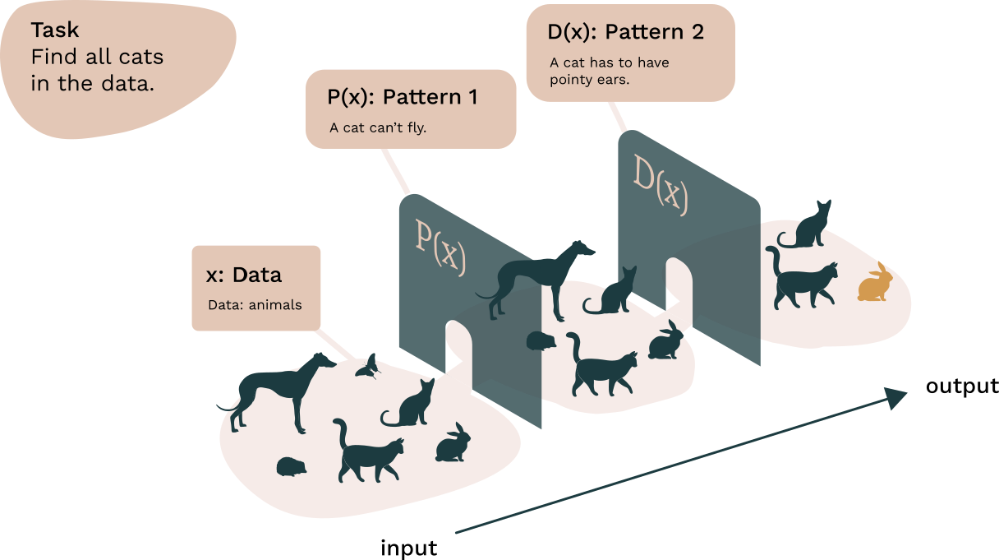
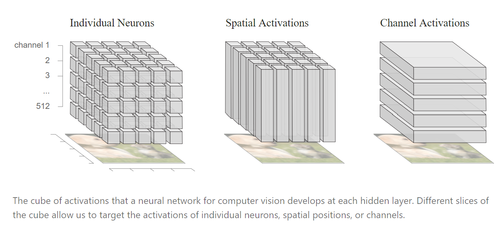
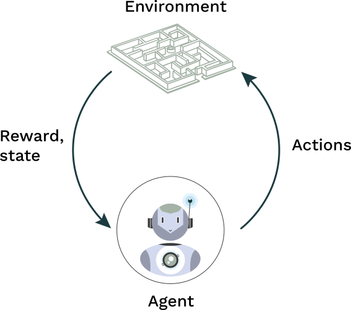
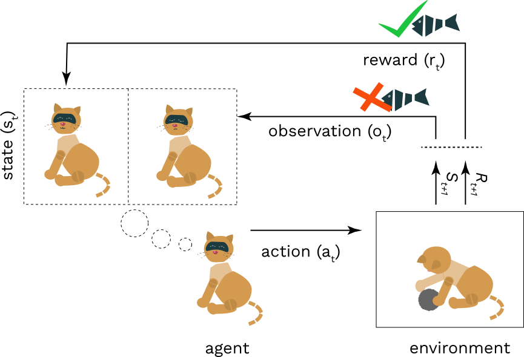

# Capítulo 4: Transparência — devemos saber como a IA funciona?

::: {.nota data-titulo="Sobre este capítulo"}
**Eixo:** Conceitos e Riscos

Por que a transparência importa, o que exatamente ela significa, e por que
sistemas de aprendizado de máquina são chamados de "caixas-pretas". Veremos
também que abertura demais, no contexto errado, cria riscos próprios.
:::

## I. Transparência na IA

### O princípio da transparência

Imagine um sistema de reconhecimento facial chamado MYFACE. O MYFACE é usado
para fins de segurança num aeroporto. Normalmente funciona perfeitamente, mas
um dia começa a classificar erroneamente indivíduos como potencialmente
perigosos. Como resultado, várias pessoas inocentes são presas. Seria
importante saber por que o sistema cometeu todos esses erros? Deveríamos ser
capazes de explicar por que ele errou? E por que isso importaria?


Alguns sistemas contemporâneos de aprendizado de máquina (*machine learning*) são os chamados
sistemas "caixa-preta" (*black box*), o que significa que não conseguimos ver
de fato como funcionam. Essa "opacidade", ou falta de visibilidade, pode ser um
problema se usamos esses sistemas para tomar decisões que afetam indivíduos.

As pessoas têm o direito de saber como decisões críticas — quem tem um pedido
de empréstimo aprovado, quem obtém liberdade condicional, quem é contratado —
são tomadas. Isso levou muitos a pedir uma "IA mais transparente".

### O que a transparência resolve

Transparência é uma propriedade de um sistema que torna possível obter certa
informação sobre seu funcionamento interno. Mas que informação é essa, e se ela
é eticamente relevante, depende em grande medida da questão ética que estamos
tentando responder. A transparência em si é eticamente neutra e não é um
conceito ético. Ela constitui, antes, um ideal. É algo que pode se manifestar
de muitas maneiras diferentes e que pode apresentar uma solução para questões
éticas subjacentes. Nesse sentido, a transparência é relevante ao menos para as
três questões seguintes:

**1) A justificação das decisões.** A boa governança nos setores público ou
privado envolve a não arbitrariedade das decisões. Isso se aplica a qualquer
tipo de tomada de decisão que tenha efeito ética ou juridicamente relevante
sobre indivíduos. Não arbitrariedade significa acesso a justificativas sobre
"por que essa decisão foi tomada, e com base em quê?". Além disso,
especialmente no caso da governança pública, a capacidade de contestar e
recorrer é crucial. Isso representa uma exigência de reparar erros.

**2) O direito de saber.** Segundo os direitos humanos, as pessoas têm
direito a explicações sobre como as decisões foram tomadas, de modo a manter
agência, liberdade e privacidade genuínas (para mais sobre direitos humanos,
veja o capítulo 5). A liberdade implica o direito de obter respostas a
perguntas como: "Como estou sendo rastreado? Que tipo de inferências estão
sendo feitas sobre mim? E como, exatamente, essas inferências foram feitas?"

**3) Uma obrigação moral de compreender as consequências de nossas ações.**
Como comunidade, também temos responsabilidade pela gestão de riscos. Existe
uma obrigação moral, até certo nível razoável, de compreender e prever as
consequências dos tipos de tecnologia que trazemos ao mundo. Ou seja, dizer
"não temos como entender agora o que isso vai fazer" não é argumento válido
para liberar um sistema que causa dano. Ao contrário, é nosso dever moral
explorar os riscos possíveis.

Esses três pontos podem ser resumidos como demandas por informação suficiente.
Sabemos se, e em que medida, esta decisão algorítmica é justificada? Sei como
as inferências sobre mim são feitas? Em que medida sou responsável pelas ações
do sistema, e quanto eu deveria saber sobre seu funcionamento interno para
poder assumir essa responsabilidade?

## II. O que é transparência?

A transparência pode ser definida de múltiplas maneiras. Há uma série de
conceitos vizinhos por vezes usados como sinônimos — entre eles
"explicabilidade" (a pesquisa em IA nessa área é conhecida como "XAI"),
"interpretabilidade", "compreensibilidade" e "caixa-preta".

A transparência é, grosso modo, uma propriedade de uma aplicação. Diz respeito
a quanto é possível compreender do funcionamento interno de um sistema "em
tese". Também pode significar a maneira de fornecer explicações sobre modelos e
decisões algorítmicas que sejam compreensíveis para o usuário. Isso trata da
percepção e da compreensão públicas de como a IA funciona. A transparência pode
ainda ser entendida como um ideal sociotécnico e normativo mais amplo de
"abertura".

Há muitas questões em aberto sobre o que constitui transparência ou
explicabilidade, e sobre qual nível de transparência é suficiente para
diferentes partes interessadas. Dependendo da situação, o significado preciso
de "transparência" pode variar. É uma questão científica em aberto se existem
vários tipos distintos de transparência. Além disso, a transparência pode se
referir a coisas diferentes conforme o objetivo seja, digamos, analisar a
relevância jurídica de vieses injustos (*bias*) ou discuti-los em termos de
características de sistemas de aprendizado de máquina.

### A transparência como propriedade de um sistema

Como propriedade de um sistema, a transparência trata de como um modelo
funciona internamente. Ela se subdivide ainda em "simulabilidade" (compreensão
do funcionamento do modelo), "decomponibilidade" (compreensão dos componentes
individuais) e transparência algorítmica (visibilidade dos algoritmos).

::: {.nota data-titulo="O que faz de um sistema uma caixa-preta?"}
**Complexidade.** Nos sistemas de IA contemporâneos, a operação de uma rede
neural é codificada em milhares, ou mesmo milhões, de coeficientes numéricos.
Normalmente o sistema aprende seus valores na fase de treinamento. Como a
operação da rede depende das interações complicadas entre esses valores, é
praticamente impossível compreender como a rede funciona mesmo que todos os
parâmetros sejam conhecidos.

**Dificuldade de desenvolver soluções explicáveis.** Mesmo que os modelos de IA
utilizados suportem algum nível de explicabilidade, é necessário
desenvolvimento adicional para construí-la no sistema. Pode ser difícil criar
uma experiência de usuário com explicações cuidadosas e ao mesmo tempo
facilmente compreensíveis.

**Preocupações com risco.** Muitos algoritmos de IA podem ser enganados se um
atacante projetar cuidadosamente uma entrada que faça o sistema funcionar mal.
Num sistema muito transparente, pode ser mais fácil burlá-lo para produzir
resultados estranhos ou indesejados. Assim, às vezes os sistemas são projetados
intencionalmente como caixas-pretas.
:::

Dado que muitos dos modelos de aprendizado profundo (*deep learning*) atuais mais eficientes são
modelos caixa-preta (quase por definição), os pesquisadores parecem supor ser
altamente improvável que consigamos desenvolvê-los como plenamente
transparentes. Por isso, a discussão se concentra em encontrar o "nível
suficiente de transparência". Bastaria que os algoritmos oferecessem às pessoas
uma divulgação de como chegaram à sua decisão e apresentassem a menor mudança
capaz de obter um resultado desejável
([Wachter et al., 2018](https://arxiv.org/pdf/1811.01439.pdf))? Por exemplo, se
um algoritmo nega um benefício social a alguém, deveria informar a razão à
pessoa e também o que ela pode fazer para reverter a decisão.

A explicação deveria informar, por exemplo, qual é o valor máximo de salário
para aprovação (entrada) e como a diminuição desse valor impactaria as decisões
tomadas (manipulação da entrada). Mas o problema é que o direito de saber
também se aplica a situações em que o sistema comete erros. Nesse caso, pode
ser necessário realizar uma autópsia no algoritmo e identificar os fatores que
o levaram a errar (Rusanen & Ylikoski, 2017). Isso não pode ser feito apenas
manipulando entradas e saídas.



Esta ilustração retrata um modelo de IA muito simplificado, encarregado de
reconhecer todos os gatos em dados compostos por animais de todo tipo. O modelo
inferiu dois padrões que compõem um gato. Para o modelo, são apenas números;
para nós, parecem padrões descritíveis. Contudo, os padrões e características
inferidos podem parecer bastante complicados para nós. Para mais informações,
veja <https://distill.pub/2017/feature-visualization/>.

Além disso, a transparência cumpre muitas outras funções nos debates
contemporâneos sobre modelos de aprendizado de máquina. Pode ser relevante para
o desenvolvimento de legislação ou para assegurar a confiança pública na IA.
Para lidar com essas questões, a noção de transparência em IA costuma receber
uma definição mais ampla, em termos de "compreensibilidade".

### A transparência como compreensibilidade

A compreensibilidade de um algoritmo exige que se explique como uma decisão foi
tomada por um modelo de IA de maneira suficientemente compreensível para os
afetados por ele. É preciso ter uma noção concreta de como ou por que
determinada decisão foi alcançada a partir das entradas.

No entanto, é notoriamente difícil traduzir conceitos derivados
algoritmicamente em conceitos compreensíveis por humanos. Em alguns países,
legisladores discutiram se as autoridades públicas deveriam publicar os
algoritmos que usam em decisões automatizadas na forma de código de
programação. Contudo, a maioria das pessoas não sabe interpretar código. É
difícil, portanto, ver como a transparência aumentaria com a publicação de
códigos.

```sas
* Toma o número da semente a partir do relógio da máquina;
data _NULL_;
 seedNumber= int(%sysfunc(TIME())) ;
 call symput('seedNumber',seedNumber);
run;
%put &seedNumber;

* Ordena o universo;
proc sort data=universe;
 by henro;
run;
* Cria uma amostra, n=2000;
proc surveyselect data=universe method=srs
     n=2000 seed=&seedNumber
     out=sample;
run;
* Ordena a amostra;
proc sort data=sample;
 by henro;
run;

 * Une a amostra ao universo e cria a variável TYPE;
data all;
 merge universe(in=a)
       sample(in=b);
 by henro;
 length TYPE $ 1.;
 if a then TYPE='V'; * grupo de referência;
 if b then TYPE='K'; * grupo experimental;

 * atribui valores à variável REAOH;
REAOH='PUOTOS';
run;

* Confirma que todas as 2000 pessoas têm TYPE com valor 'K';
proc freq;
 tables type;
run;
```

Seria mais útil publicar os algoritmos exatos? Na maioria dos casos, publicar
os algoritmos exatos também não traz muita transparência, especialmente se não
se tem acesso aos dados usados no modelo.


Atualmente, cientistas cognitivos e da computação desenvolvem descrições
interpretáveis por humanos sobre como as aplicações se comportam e por quê. As
abordagens incluem, por exemplo, o desenvolvimento de ferramentas de
visualização de dados, interfaces interativas, explicações verbais ou
descrições em metanível das características dos modelos. Essas ferramentas
podem ser extremamente úteis para tornar as aplicações de IA mais acessíveis.
Ainda assim, há muito trabalho a ser feito.



*Diagrama CC BY 4.0 Olah et al., "The Building Blocks of Interpretability",
Distill, 2018.*

O fato de a compreensibilidade se apoiar em componentes dependentes do sujeito
e da cultura complica ainda mais o quadro. Por exemplo, a lógica de como
visualizações são interpretadas — ou de como inferências são feitas a partir
delas — varia entre culturas. Assim, desenvolvedores devem prestar atenção à
compreensão suficiente da linguagem visual que empregam.

Além disso, muito depende do grau de letramento em dados ou algoritmos, por
exemplo do conhecimento das tecnologias contemporâneas. Em algumas culturas, o
vocabulário da tecnologia atual é mais familiar; em muitas outras, pode ser
completamente novo. Para aumentar a compreensibilidade, há uma necessidade
clara de esforços educacionais significativos na melhoria do letramento
algorítmico — por exemplo, em "pensamento computacional"
([Heintz et al., 2016](https://ieeexplore.ieee.org/document/7757410)). Esse
letramento do usuário terá efeito direto sobre a transparência, no sentido da
compreensão básica que os usuários comuns têm dos sistemas de IA. Pode ser, na
prática, o modo mais eficiente e concreto de tornar as caixas menos pretas para
muita gente.

::: {.tecnica data-titulo="Como tornar modelos mais transparentes?"}
O problema da caixa-preta da inteligência artificial não é novo. Prover
transparência a modelos de aprendizado de máquina é uma área ativa de pesquisa.
Grosso modo, há cinco abordagens principais:

* **Usar modelos mais simples.** Isso, porém, com frequência sacrifica
  acurácia em troca de explicabilidade.

* **Combinar modelos simples e sofisticados.** Enquanto o modelo sofisticado
  permite ao sistema realizar cálculos mais complexos, o modelo simples pode
  ser usado para prover transparência.

* **Modificar as entradas para rastrear dependências relevantes entre entradas
  e saídas.** Se a manipulação das entradas altera os resultados gerais do
  modelo, essas entradas podem ter papel na classificação.

* **Projetar os modelos para o usuário.** Isso requer usar métodos e
  ferramentas cognitiva e psicologicamente eficientes para visualizar os
  estados do modelo ou dirigir a atenção. Por exemplo, em visão computacional,
  estados em camadas intermediárias dos modelos podem ser visualizados como
  características (cabeças, braços, pernas), oferecendo uma descrição
  compreensível para a classificação de imagens. Pesquisadores também
  desenvolveram métodos para dirigir a "atenção" às partes da entrada que mais
  importam. Elas podem ser visualizadas para destacar as partes de uma imagem
  ou de um texto (os chamados "pesos") que mais contribuem para determinada
  recomendação.

* **Acompanhar a pesquisa mais recente.** Há muita pesquisa em curso sobre
  diversos aspectos da IA explicável — incluindo as dimensões
  sociocognitivas — e novas técnicas vêm sendo desenvolvidas.
:::

::: {.reflexao data-titulo="Exercícios desta seção"}
O material original traz aqui um questionário interativo. As perguntas não
constam do repositório de origem — ficam no banco de dados da plataforma. O
exercício correspondente deve ser redigido em
`exercicios/capitulo04-exercicios.md`.
:::

### Estudo de caso: três visualizações do mesmo algoritmo

::: {.caso data-titulo="Qual delas é compreensível?"}
Há necessidade de traduzir conceitos algorítmicos para a linguagem cotidiana. A
maioria das pessoas sem formação em computação não conhece o vocabulário básico
da IA, o que afeta diretamente sua capacidade de compreender os
desenvolvimentos recentes.

**1.**


**2.**



**3.**



Compare estas três visualizações de algoritmos de aprendizado por reforço. Qual
delas é a mais compreensível? Por quê?
:::

## III. Transparência e os riscos da abertura

A transparência frequentemente denota um "ideal" ético, social e jurídico
moderno (Koivisto, 2016), uma exigência normativa para o uso aceitável da
tecnologia em nossas sociedades. É um reflexo do ideal de "abertura", formulado
em termos de "governo aberto", "dados abertos", "código aberto/acesso aberto",
bem como "ciência aberta" (Larsson, 2020). Nesse sentido, considerações sobre
transparência são necessárias para favorecer a distribuição equitativa dos
avanços científicos, de modo que os benefícios do desenvolvimento da IA possam
ser acessíveis a todas as pessoas.

::: {.nota data-titulo="O paradoxo da abertura"}
Paradoxalmente, o ideal de abertura também pode levar a consequências danosas.
Por exemplo, a transparência das plataformas de redes sociais levou a diversos
casos de uso indevido e a desafios democráticos. A transparência pode criar
riscos de segurança. Transparência demais pode levar ao vazamento de dados
sensíveis à privacidade para as mãos erradas. Ou ainda: quanto mais se revela
sobre os algoritmos e os dados, mais dano um ator malicioso pode causar.
Algoritmos podem ser invadidos, e a informação pode tornar a IA mais vulnerável
a ataques intencionais. Algoritmos inteiros também podem ser roubados apenas a
partir de suas explicações.
:::

Em resumo, embora haja necessidade de desenvolver práticas mais transparentes
para a IA, também é preciso desenvolver práticas que ajudem a evitar abusos.
Ainda que a transparência possa ajudar a mitigar questões éticas — como
equidade ou responsabilização (*accountability*) —, ela também cria riscos eticamente
importantes. Abertura demais no contexto errado pode frustrar o desenvolvimento
positivo de processos habilitados por IA. Em conjunto, fica claro que o ideal
de transparência total dos algoritmos deve ser considerado com cuidado, e será
preciso encontrar um equilíbrio entre as exigências de segurança e as de
transparência.

::: {.reflexao data-titulo="Exercícios desta seção"}
O material original traz aqui um questionário interativo. As perguntas não
constam do repositório de origem. O exercício correspondente deve ser redigido
em `exercicios/capitulo04-exercicios.md`.
:::

## Referências

Heintz, F., Mannila, L., & Färnqvist, T. (2016). A review of models for
introducing computational thinking, computer science and computing in K-12
education. *IEEE Frontiers in Education Conference*.
<https://ieeexplore.ieee.org/document/7757410>

Koivisto, I. (2016). The anatomy of transparency: The concept and its
multifarious implications.
<!-- TODO: completar referência: periódico/veículo -->

Larsson, S. (2020). On the governance of artificial intelligence through
ethics guidelines.
<!-- TODO: completar referência: veículo -->

Olah, C., et al. (2018). The Building Blocks of Interpretability. *Distill*.
<https://distill.pub/2018/building-blocks/>
<!-- TODO: verificar procedência desta URL, não está no original -->

Rusanen, A.-M., & Ylikoski, P. (2017).
<!-- TODO: completar referência: título/periódico -->

Wachter, S., Mittelstadt, B., & Russell, C. (2018). Counterfactual
Explanations Without Opening the Black Box: Automated Decisions and the GDPR.
<https://arxiv.org/pdf/1811.01439.pdf>

---

::: licenca
**Material original:** *Ethics of AI*, um curso online gratuito da
Universidade de Helsinque. Professores responsáveis: Anna-Mari Rusanen e
Jukka K. Nurminen. Demais contribuintes principais: Santeri Räisänen, Sasu
Tarkoma e Saara Halmetoja. Disponível em <https://ethics-of-ai.mooc.fi/>.

**Esta versão:** tradução e adaptação para o português brasileiro realizada
por José Lucas Lira Bizil, Fernando Mazzeto Lisboa Lima e Matheus da Silva Fernandes, no âmbito do Programa CiberExt 26-29 (FEELT38103),
Universidade Federal de Uberlândia, 2026. Esta é uma obra derivada; os autores
originais não a revisaram nem a endossam.

**Licença:** Creative Commons Atribuição-NãoComercial-CompartilhaIgual 4.0
Internacional (CC BY-NC-SA 4.0) —
<https://creativecommons.org/licenses/by-nc-sa/4.0/deed.pt-br>.
:::
