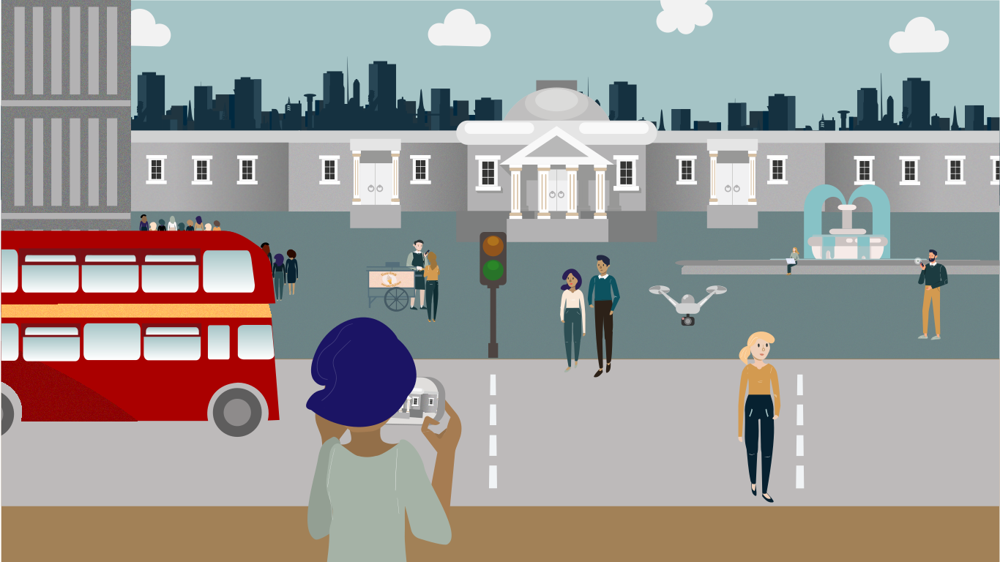
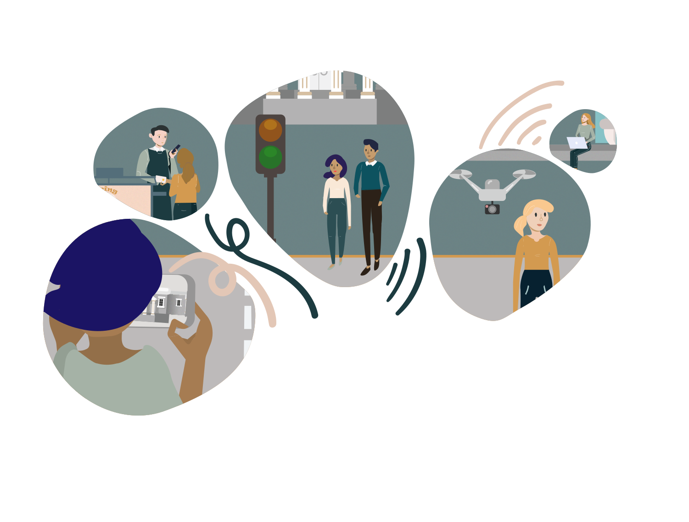

# Capítulo 5: Direitos humanos — a IA deve respeitá-los e promovê-los?

::: {.nota data-titulo="Sobre este capítulo"}
**Eixo:** Conceitos, Aplicações e Riscos

Os direitos humanos são o alicerce das diretrizes éticas de IA. Este capítulo
examina privacidade, segurança e inclusão, o RGPD e as técnicas de anonimização,
a divisão de gênero na tecnologia e os direitos específicos das crianças.
:::

## I. Introdução

Durante a pandemia de covid-19, governos tiveram dificuldade para encontrar
estratégias eficazes de saída do confinamento de forma segura. Segundo
epidemiologistas, reabrir a sociedade exige rastreamento, monitoramento e
acompanhamento eficientes. Em muitos casos, isso levou ao uso de diversos
aplicativos de rastreamento. Esses aplicativos levantaram várias preocupações
com privacidade e segurança. Críticos os viram como os primeiros passos rumo à
vigilância algorítmica dos cidadãos.

Em Londres, as autoridades decidiram tentar algo novo. Junto com cientistas,
desenvolveram métodos para "capturar a atividade em Londres" e assim
compreender melhor o nível de atividade da cidade. Num projeto chamado
[Odysseus](https://www.turing.ac.uk/research/research-projects/project-odysseus-understanding-london-busyness-and-exiting-lockdown),
as autoridades obtêm informações sobre a distribuição de atividades em Londres
combinando algoritmos de aprendizado de máquina (*machine learning*), análise estatística de séries
temporais e processamento de imagens. Essa informação sobre a atividade nas
ruas de Londres pode ser usada para a reabertura segura das vias e para o
planejamento de saúde pública.

No Odysseus, os dados vêm de uma ampla gama de fontes. O projeto combina dados
agregados e anonimizados de telefonia móvel, transações anonimizadas de cartão
de crédito, dados de navegação por satélite e dados de sensores e câmeras de
trânsito nas ruas. Esses dados são usados para criar contagens de veículos,
ciclistas e pedestres, e para indicar a densidade e os efeitos do
distanciamento social. Atenção especial é dada à anonimização, de modo que
indivíduos não possam ser identificados.

Neste capítulo, vamos olhar para os direitos humanos. O direito a um ambiente
seguro é um deles. O Odysseus é um exemplo de como a IA pode ser usada de
maneira que respeite e promova o direito à segurança ou a um ambiente saudável.
Ao mesmo tempo, o projeto precisa levar em conta outros direitos — como o
direito à privacidade. Em Londres, essas preocupações foram levadas a sério.
Para garantir a privacidade, o Odysseus é projetado de modo que todos os dados
sejam anonimizados e que indivíduos não possam ser identificados nas imagens
captadas pelas câmeras de trânsito.

Privacidade e segurança atraíram muita atenção da mídia. São importantes, mas é
necessário considerar também o impacto da IA sobre todo o espectro de direitos
e liberdades fundamentais. Como a IA impactará o direito à educação e ao
trabalho, ou a um julgamento justo, a eleições justas e abertas, à liberdade de
expressão, à reunião e à manifestação? E quanto a grupos específicos, como as
crianças? Mas, primeiro, discutamos o que são direitos humanos.

## II. O que são direitos humanos?

Os direitos humanos formam a base das atuais diretrizes e princípios éticos de
IA. Isso os torna um componente fundamental da ética contemporânea da IA. Como
direitos, os direitos humanos são **universais**: todos os seres humanos têm
direito a eles. Não é preciso ser um tipo específico de pessoa ou membro de
alguma comunidade específica para tê-los.

Os direitos humanos são **normas** que protegem todas as pessoas, em qualquer
lugar, contra abusos políticos, jurídicos e sociais. Incluem:

* **Direitos civis e políticos**, como o direito à vida, à liberdade e à
  propriedade, a liberdade de expressão, a busca da felicidade e a igualdade
  perante a lei;
* **Direitos sociais, culturais e econômicos**, incluindo o direito de
  participar da ciência e da cultura, o direito ao trabalho e o direito à
  educação.

O papel dos direitos humanos é proteger a capacidade das pessoas de formar,
interpretar e perseguir suas próprias concepções de uma vida que valha a pena —
não se trata apenas da capacidade de viver "em liberdade, felicidade e
bem-estar".

::: {.nota data-titulo="O que é um direito humano?"}
Um direito humano é uma norma que pode existir em diferentes níveis:

* uma norma compartilhada das moralidades humanas efetivas;
* uma norma moral justificada, apoiada por razões fortes;
* um direito legal em nível nacional (onde pode ser chamado de direito "civil"
  ou "constitucional");
* um direito legal no âmbito do direito internacional.

**O que é a Declaração Universal dos Direitos Humanos?**

A [Declaração Universal dos Direitos Humanos](https://www.un.org/en/about-us/universal-declaration-of-human-rights)
(DUDH) é um documento redigido por representantes com diferentes formações
jurídicas e culturais, de todas as regiões do mundo. A declaração foi
proclamada pela Assembleia Geral das Nações Unidas em Paris, em 10 de dezembro
de 1948 (resolução 217 A da Assembleia Geral), como padrão comum de realizações
para todos os povos e todas as nações.
:::

Conceitualmente, os direitos humanos fundam-se na agência e na autonomia
(Gewirth, 1982). Têm prioridade ética: se entram em concorrência com outras
considerações, como riqueza econômica, estabilidade nacional ou algum outro
fator, os direitos humanos devem ser priorizados. No contexto da IA, essa
priorização implica os seguintes requisitos:

* aplicações de IA que possam claramente violar direitos humanos não devem ser
  usadas;
* aplicações de IA que impeçam as pessoas de gozar de seus direitos humanos, ou
  que ativamente as coloquem em risco de violação, não devem ser usadas.

Contudo, os direitos humanos têm certas propriedades sensíveis ao contexto, que
permitem priorizar um direito humano específico quando necessário. Alguns
direitos são mais fundamentais do que outros. Por exemplo, quando o direito à
vida conflita com o direito à privacidade, o direito à privacidade geralmente
será superado.

Nos últimos anos, preocupações com privacidade e segurança dominaram a
discussão sobre IA e direitos humanos. Combinações emergentes de análise de
*big data*, tecnologias de vigilância e métodos de reconhecimento biométrico em
desenvolvimento receberam atenção significativa da mídia e das políticas
públicas. Também o direito à igualdade e à inclusão suscitou bastante discussão
pública. Na próxima seção, examinaremos brevemente esses debates.

## III. Exemplos de direitos humanos: privacidade, segurança e inclusão

### Privacidade

Preocupações com privacidade são levantadas, por exemplo, por registros
digitais que contêm informações capazes de permitir a inferência de atributos
sensíveis (idade, gênero ou orientação sexual), preferências ou posições
religiosas e políticas. Dados biométricos também levantam preocupações, pois
podem revelar detalhes de saúde física e mental. Muitas vezes, a preocupação
real não é o dado em si, mas o modo como ele pode ser usado para manipular,
afetar ou prejudicar uma pessoa.

Eticamente, a privacidade relaciona-se à autonomia e à integridade pessoais.
Seguindo os princípios estabelecidos por John Locke, o direito de controlar
nossa própria vida pessoal tem sido visto como central para nossa autonomia. Se
esse direito é retirado, viola-se algo fundamental de nossa integridade
psicológica e moral.

::: {.filosofia data-titulo="O que são os \"seus\" dados?"}
Muitos propuseram o princípio de que as pessoas devem ter controle sobre os
próprios dados — e de que os dados a seu respeito não devem poder ser usados
para prejudicá-las ou discriminá-las. Segundo alguns, esse direito ao "controle
pleno sobre os próprios dados" deveria ser um direito humano.

Mas o que exatamente são os "seus dados"? São os dados brutos, ou os dados
coletados e analisados? Se os dados são usados para finalidades secundárias,
ainda são seus? Ou, como observam Wachter e Mittelstadt
([2019](https://osf.io/preprints/lawarxiv/mu2kf/)), o conteúdo das inferências
que podem ser extraídas de seus dados pertence aos "seus dados"?

Wachter e Mittelstadt (2019) propõem que o direito ao controle dos próprios
dados seja reformulado como um direito a "inferências razoáveis". Segundo eles,
é crucial que possamos controlar também as "inferências de alto risco" que
podem ser feitas sobre nós por meio de análise de *big data*. Essas inferências
invadem a privacidade ou danificam a reputação, ou têm baixa verificabilidade
(no sentido de serem preditivas ou baseadas em opinião), sendo ao mesmo tempo
usadas para decisões importantes.
:::

#### O RGPD

O Regulamento Geral sobre a Proteção de Dados
([RGPD](https://gdpr.eu/what-is-gdpr/), ou GDPR em inglês) é um marco jurídico.
Estabelece diretrizes para a coleta e o processamento de dados pessoais de
indivíduos que vivem na União Europeia.

O objetivo do RGPD é dar aos indivíduos controle sobre seus dados pessoais.
Qualquer informação relativa a um indivíduo que possa ser direta ou
indiretamente identificado é "dado pessoal". Isso inclui nomes, números de
identificação social e endereços de e-mail. Informações de localização, dados
biométricos, etnia, gênero, *cookies* de navegação e crenças políticas ou
religiosas também podem ser dados pessoais. Dados pseudonimizados (que não
identificam diretamente um indivíduo, mas podem ser a ele conectados) também
podem se enquadrar na definição, se for fácil individualizar alguém a partir
deles.

O titular dos dados deve dar consentimento específico e inequívoco para o
processamento. Os consentimentos devem ser "livres, específicos, informados e
inequívocos". Titulares podem retirar a qualquer momento um consentimento
previamente dado. Crianças menores de 13 anos só podem consentir com
autorização dos pais.

O RGPD reconhece diversos direitos de privacidade para os titulares, com o
objetivo de lhes dar mais controle sobre os dados. Alguns deles:

* o direito de ser informado (a pessoa deve ser avisada sobre o uso de seus
  dados pessoais);
* o direito de acesso (deve ser explicado como os dados pessoais de alguém são
  usados);
* o direito de retificação (a pessoa tem direito ao esquecimento e à exclusão
  dos dados);
* o direito de restringir o processamento (a pessoa pode negar o uso de seus
  dados pessoais).

Se você processa dados, o RGPD exige que o faça segundo princípios de proteção
e responsabilização (*accountability*). Esses princípios devem ser considerados no projeto de
qualquer novo produto ou atividade. São eles:

* **Licitude, lealdade e transparência:** o processamento deve ser lícito,
  leal e transparente para o titular.
* **Limitação da finalidade:** os dados devem ser processados para as
  finalidades legítimas especificadas explicitamente ao titular no momento da
  coleta.
* **Minimização dos dados:** deve-se coletar e processar apenas a quantidade de
  dados absolutamente necessária para as finalidades especificadas.
* **Exatidão:** os dados pessoais devem ser mantidos exatos e atualizados.
* **Limitação da conservação:** dados de identificação pessoal só podem ser
  armazenados pelo tempo necessário à finalidade especificada.
* **Integridade e confidencialidade:** o processamento deve ser feito de modo a
  assegurar segurança, integridade e confidencialidade adequadas (por exemplo,
  com criptografia).
* **Responsabilização:** o controlador dos dados é responsável por poder
  demonstrar conformidade com todos esses princípios.

Segundo o RGPD, quem processa dados também é obrigado a tratá-los com segurança
por meio de "medidas técnicas e organizacionais apropriadas".

#### Como proteger a privacidade — métodos de anonimização

O RGPD permite que organizações coletem dados anonimizados sem consentimento,
os usem para qualquer finalidade e os armazenem por tempo indefinido — desde
que removam todos os identificadores. Há várias técnicas de anonimização,
entre elas:

* **Generalização** é um método que remove deliberadamente parte dos dados para
  torná-los menos identificáveis. Os dados podem ser transformados num conjunto
  de faixas ou numa área ampla com limites apropriados. É possível remover, por
  exemplo, o endereço da rua mantendo a informação do nome da cidade. Assim,
  eliminam-se alguns identificadores preservando certo grau de exatidão.

* **Pseudonimização** é um método de gestão de dados e de desidentificação que
  substitui identificadores privados — nomes, códigos de identificação — por
  identificadores falsos ou pseudônimos, por exemplo trocando o identificador
  "Santeri" por "Saara". A pseudonimização preserva a exatidão estatística e a
  integridade dos dados. Os dados modificados podem ser usados protegendo ao
  mesmo tempo a privacidade.

* **Dados sintéticos** é um método que usa conjuntos de dados artificiais
  criados, em vez de alterar o conjunto original. O processo envolve criar
  modelos estatísticos com base nos padrões encontrados no conjunto original.
  Podem-se usar desvios-padrão, medianas, regressão linear ou outras técnicas
  estatísticas para gerar os dados sintéticos.

A anonimização pode ser desafiadora. Existem também métodos de
"desanonimização", que tentam reidentificar informações criptografadas ou
ocultadas. A desanonimização, também chamada de reidentificação de dados, pode,
por exemplo, cruzar informações anonimizadas com outros dados disponíveis para
identificar uma pessoa, um grupo ou uma transação.

### Segurança

O direito à segurança é uma norma que protege indivíduos contra danos físicos,
sociais e emocionais, incluindo acidentes e falhas de funcionamento. Em inglês,
distingue-se *safety* (segurança contra acidentes e falhas) de *security*
(segurança contra ameaças maliciosas e intencionais); em português, ambas são
"segurança", e o contexto indica de qual se trata.

Como direito, a segurança cria uma obrigação moral de projetar nossos produtos,
leis e ambientes de tal modo que ela seja protegida mesmo em circunstâncias não
convencionais ou diante de limitações. Em relação à IA, a segurança passou a
abranger várias conversas distintas:

#### 1) A IA como ameaça existencial

A conversa sobre a IA como ameaça existencial adota uma postura altamente
especulativa e orientada ao futuro. Concentra-se em perguntar que tipo de
ameaças à humanidade seriam colocadas por sistemas de IA caso se tornassem
complexos demais para serem controlados (esse tipo de cenário de
"superinteligência" é pintado por pensadores como Nick Bostrom e Ray Kurzweil).

Contudo, a plausibilidade de um futuro de IA superinteligente foi questionada
tanto por filósofos quanto por tecnólogos. No estado atual das coisas, não há
razão para supor que a superinteligência emergirá do desenvolvimento dos
métodos algorítmicos contemporâneos.

#### 2) Segurança na IA

A segunda interpretação da segurança em IA é a questão prática de projetar
sistemas que se comportem de maneira segura e previsível. À medida que sistemas
de IA são integrados a áreas cada vez mais amplas da vida, torna-se mais
importante que sejam bem projetados para dar conta da complexidade do mundo. Um
exemplo muito prático e já existente é a tecnologia de manutenção de faixa, que
usa aprendizado de máquina para impedir que carros saiam de sua faixa.
Pesquisadores descobriram que alguns algoritmos de detecção de faixa são
bastante fáceis de confundir com marcações de pista falsas, fazendo o carro
sair da estrada ao seguir as marcações forjadas.

::: {.tecnica data-titulo="Robustez"}
Pode-se argumentar que o direito à segurança obriga os produtores de tecnologia
a considerar esse tipo de cenário: o fato de o ambiente não ser ideal não
desculpa o mau funcionamento do sistema. Pesquisadores de aprendizado de
máquina chamam essa característica de **robustez** — a capacidade do sistema de
funcionar de modo previsível sob circunstâncias novas e imprevisíveis.
:::

A questão ética — e juridicamente — significativa é: "quais são os limites
aceitáveis da robustez?" É certamente concebível que exista um conjunto de
circunstâncias tão improváveis que, mesmo não sendo possível assegurar a
segurança do sistema, possamos admitir que "ninguém poderia realisticamente ter
previsto isso". Onde fica esse limite, porém, é um problema difícil, e
certamente não exclusivo da IA nem mesmo da tecnologia.

Ainda assim, o entusiasmo progressista associado às visões de futuro da IA
trouxe à tona questões sobre os limites da segurança e a domesticação da
incerteza ambiental de um modo inteiramente novo. Um exemplo pode ser
encontrado na discussão sobre veículos autônomos.

::: {.definicao data-titulo="Caso: calçadas engaioladas — segurança da IA e incerteza ambiental"}
Um problema difícil para veículos autônomos é a imprevisibilidade complexa do
ambiente de tráfego urbano. Ainda que veículos guiados por IA sejam
constantemente aprimorados para modelar melhor seu entorno, mesmo um pequeno
grupo de pessoas — cada uma perseguindo seus próprios objetivos de movimento
num espaço compartilhado — cria uma constelação difícil de prever. Quando as
soluções técnicas nos carros estão distantes demais, outra forma de abordar a
questão é conter a incerteza no ambiente.

Numa coluna no *New York Times*, o consultor Eric A. Taub propôs uma solução:
cercando as calçadas com gaiolas, com portões sincronizados aos semáforos nas
travessias, o ambiente complexo de tráfego é simplificado, tornando-se mais
compreensível para os veículos autônomos e, portanto, mais seguro. Contudo,
essa segurança tem um custo evidente: limitar a liberdade dos pedestres e
redistribuir a responsabilização. Isso significa que devemos olhar para os
limites em que se cruzam o direito à segurança e o direito à liberdade. Qual
deles é mais importante?

Ou será isso apenas uma falsa dicotomia, produzida por uma solução técnica que
nunca foi muito viável em primeiro lugar? Outra linha de pensamento
interessante que se pode traçar aqui é a criminalização daquilo que nos Estados
Unidos se chama *jaywalking*: atravessar a rua fora da faixa de pedestres. O
conceito de *jaywalking* não existia até que as vias fossem reconcebidas tendo
os veículos automotores como usuários principais. Quão comparável é isso à
ideia de engaiolar as calçadas?
:::

#### 3) Produzir segurança com IA

O terceiro conceito de segurança e IA que examinaremos é a produção de
segurança pelo uso da IA. Pode a IA tornar o mundo mais seguro? Pode fazer o
mundo *parecer* mais seguro? E mais seguro para quem?

A robotização oferece um exemplo desse conceito na prática. O trabalho com
materiais perigosos ou em ambientes perigosos pode ser delegado a robôs,
protegendo a saúde de trabalhadores humanos (ou de animais).

Outra maneira pela qual certas formas de segurança são produzidas por IA é a
vigilância automatizada. A vigilância movida por IA manifestou-se em muitos
domínios: em espaços públicos, no trabalho policial por meio do policiamento
preditivo, e na vida doméstica por meio de produtos como o Ring, da Amazon.
Embora câmeras de vigilância (CCTV) existam e dominem espaços públicos e
semipúblicos há décadas, a ACLU argumenta que a automação produz uma grande
mudança qualitativa no modo como a vigilância funciona. Mas o que é tão
diferente?

> Imagine uma câmera de vigilância numa loja de conveniência típica dos anos
> 1980. Era grande e cara, ligada por um fio que atravessava a parede até um
> videocassete numa sala nos fundos. Houve avanços significativos na tecnologia
> de câmeras nas décadas seguintes — em resolução, digitalização,
> armazenamento e transmissão sem fio — e as câmeras se tornaram mais baratas e
> muito mais disseminadas.
>
> Ainda assim, apesar de todos esses avanços, as implicações sociais de ser
> gravado não mudaram: quando entramos numa loja, em geral esperamos que a
> presença de câmeras não nos afete. Esperamos que nossos movimentos sejam
> registrados, e podemos nos sentir constrangidos ao notar uma câmera,
> sobretudo se estivermos fazendo algo que possa atrair atenção. Mas, a menos
> que algo dramático ocorra, entendemos em geral que é improvável que os vídeos
> em que aparecemos sejam examinados ou monitorados.
>
> <cite>*The Dawn of Robot Surveillance*, ACLU</cite>

::: {.nota data-titulo="Efeitos inibidores"}
A vigilância constante produz **"efeitos inibidores"** (*chilling effects*). Ou
seja, a consciência de que nossas ações são constantemente observadas limita
nossa verdadeira liberdade de agir no mundo. Imagine que, sempre que sai de
casa, você é seguido por dois policiais. Eles nunca interagem com você, apenas
caminham dez metros atrás. Você provavelmente se sentirá incomodado e incapaz
de tocar seu dia como normalmente faria. Nesse sentido, a segurança às vezes se
opõe à liberdade pessoal e à privacidade.
:::

Além disso, é uma questão empírica em aberto até que ponto a vigilância por IA
realmente produz segurança. Como ilustra o exemplo dos efeitos inibidores, a
própria existência da vigilância por IA pode contribuir para uma sensação de
insegurança. Ainda mais: pode contribuir diretamente para a insegurança real e
produzir dano. O policiamento movido por IA, por exemplo, pode levar a dano
físico direto por causa de sua natureza preditiva e dos métodos de aplicação da
lei. E quando a vigilância ubíqua e automática permite que até as transgressões
mais banais sejam vigiadas e registradas, corre-se o risco de tornar as
consequências do policiamento mais danosas do que o delito original.

Com níveis desiguais de policiamento, métodos desiguais de aplicação da lei e
níveis desiguais de vigilância entre comunidades — de forma mais evidente ao
longo de linhas raciais —, fica claro que a vigilância por IA cria um tipo
diferente de segurança (e de insegurança) para pessoas diferentes. Novamente,
como antes, o valor da segurança se entrelaça com outros valores éticos, como
justiça e não discriminação.

#### 4) Um ambiente seguro e saudável: IA e mudança climática

Segurança também significa o direito a um ambiente seguro e saudável.
Atualmente, esse direito é ameaçado pela mudança climática. Os efeitos já são
visíveis: tempestades, secas, incêndios e inundações tornaram-se mais comuns,
mais frequentes e mais devastadores. Ecossistemas globais estão mudando. Todos
impactam o ambiente do qual nossa existência depende. O relatório sobre mudança
climática (2018) estimou que o mundo enfrentará consequências catastróficas a
menos que as emissões globais de gases de efeito estufa sejam eliminadas em
trinta anos.

::: {.tecnica data-titulo="IA e clima: os dois lados"}
A IA pode ser uma ferramenta poderosa para enfrentar a mudança climática. Pode
ser usada como recurso para monitorar, compreender e prever as consequências do
fenômeno. Pode acelerar o desenvolvimento de sociedades ecologicamente mais
sustentáveis. Pode ser usada para projetar cidades verdes, transporte
ambientalmente amigável, reduzir o impacto ecológico da indústria e projetar
equipamentos que ajudem a estudar e manter a diversidade dos ecossistemas.

Ao mesmo tempo, muitos problemas potenciais estão associados à implantação da
IA — por exemplo, inovações que buscam reduzir emissões de gases de efeito
estufa podem, na prática, aumentar o consumo de energia e as emissões. Dado o
caráter intensivo em dados e recursos da IA contemporânea, a própria tecnologia
ainda enfrenta dificuldades com consumo de energia e pegada de carbono. É
preciso atentar também para o impacto ambiental da extração de matérias-primas
que sustenta a fabricação de tecnologias de IA, que pode ser significativo.
:::

Em resumo, a segurança se relaciona com as tecnologias de IA de múltiplas
maneiras. Todas levantam questões sobre o equilíbrio de valores normativos:
embora chamados por uma "IA para o bem" soem promissores, na prática a
efetivação de direitos e valores normativos em sistemas tecnológicos com
frequência colide com a profusão de interesses conflitantes e injustiças
profundas existentes no mundo. Ao avaliar a segurança, é importante avaliar que
outros direitos se cruzam na prática e perguntar: "segurança para quem?"

## IV. Inclusão e a divisão de gênero

Inclusão significa que todas as pessoas, independentemente das características
que as tornam diferentes — raça, gênero, sexualidade, capacidade ou outro
traço —, têm direito igual de participar plenamente da sociedade.

#### Inclusão de pessoas com deficiência

Segundo a Organização Mundial da Saúde (2018), mais de um bilhão de pessoas
vivem com alguma deficiência. Por um lado, a IA pode marginalizar e excluir
ainda mais essas pessoas. Por outro, tecnologias de IA têm enorme potencial de
promover seu bem-estar. A IA poderia "aumentar" e apoiar pessoas com
deficiência.

Por exemplo, existem diversas ferramentas para desenvolver habilidades de
comunicação e letramento que podem oferecer apoio à compreensão de pessoas com
deficiências cognitivas e/ou dificuldades complexas de fala e linguagem (como
demência, paralisia cerebral e autismo). Além disso, o desenvolvimento de
tecnologias assistivas com IA fornece outros exemplos: descrição de imagens
para pessoas cegas, reconhecimento de fala, legendagem para pessoas com
deficiência auditiva, reconhecimento e geração de língua de sinais para pessoas
surdas, opções multilíngues de texto-para-fala para leitura de textos por
pessoas com deficiências cognitivas, incluindo dislexia, robôs de cuidado para
idosos e guias de mobilidade para pessoas com deficiência visual.

#### Inclusão e a divisão de gênero

Muitos pesquisadores de tecnologia têm atentado para a "lacuna de gênero" ou
"divisão de gênero". Essa lacuna tem muitas faces. Primeiro, segundo a
[Unesco](https://en.unesco.org/EQUALS/policy-paper), as habilidades digitais e
de letramento algorítmico das mulheres não estão no mesmo nível das dos homens.
Mulheres têm menos probabilidade de saber operar ou usar computadores, navegar
na internet, usar redes sociais e compreender como proteger informações em
mídias digitais — habilidades que sustentam inúmeras tarefas de vida e de
trabalho e são relevantes para pessoas de todas as idades. A Unesco estima que
homens têm cerca de quatro vezes mais probabilidade que mulheres de possuir
habilidades avançadas em tecnologias da informação e comunicação (TIC), como a
capacidade de programar.

Mulheres também têm menos probabilidade de criar tecnologia de ponta. Segundo
estudos, nos países do G20 apenas 7% das patentes em TIC são geradas por
mulheres. Uma pesquisa recente com estudantes de graduação em 29 países
constatou que os primeiros adotantes de novas tecnologias são
predominantemente homens. Cálculos baseados nos participantes das principais
conferências mundiais de aprendizado de máquina em 2017 indicam que apenas 12%
dos pesquisadores líderes da área são mulheres.

::: {.nota data-titulo="Por que isso importa"}
A falta de diversidade na tecnologia pode ter efeito sério à medida que *big
data* e algoritmos se tornam influentes no cotidiano. A IA é hoje usada desde a
indústria da saúde até o sistema jurídico, e afeta as trajetórias de vida das
pessoas de muitas maneiras. Como cada vez mais ferramentas digitais são
construídas por homens, muitos temem que o espaço digital esteja se tornando
crescentemente marcado por gênero.
:::

Estudos de tecnologia indicam que a tecnologia frequentemente reflete seus
desenvolvedores. Por exemplo, apesar de a maioria das mulheres de baixa renda
em países em desenvolvimento trabalhar principalmente na agricultura, os homens
foram os principais adotantes e desenvolvedores de tecnologias agrícolas, e as
inovações e ferramentas agrícolas foram projetadas especificamente para uso
masculino. Como resultado, muitas ferramentas foram desenvolvidas para o
trabalho dos homens no campo e são reconhecidamente pesadas demais para que
mulheres as empurrem, ou têm cabos que elas não alcançam. Exatamente o mesmo se
aplica com frequência à tecnologia inteligente atual: sistemas de comando de
voz não reconhecem a fala feminina, e os tamanhos de *smartphones* e teclados
não são adequados a usuárias.

A inclusão, contudo, é mais do que assegurar que mulheres possam participar. É
uma obrigação de garantir diversidade cultural, etária e geográfica, e suas
intersecções. Ao pensar no impacto da IA na sociedade há, simplesmente, a
necessidade de desenvolver sistemas intencionalmente em contextos diferentes e
com usuários diversos.

::: {.reflexao data-titulo="Exercícios desta seção"}
O material original traz aqui um questionário interativo. As perguntas não
constam do repositório de origem — ficam no banco de dados da plataforma. O
exercício correspondente deve ser redigido em
`exercicios/capitulo05-exercicios.md`.
:::

## V. Direitos da IA para crianças

Você já pensou em quanto a IA impacta as crianças? Elas são expostas a
algoritmos em casa, na escola e nas brincadeiras. Algoritmos moldam os
ambientes em que vivem, os serviços a que têm acesso e o modo como passam o
tempo. Crianças brincam com brinquedos inteligentes interativos, assistem a
vídeos recomendados por algoritmos, usam comandos de voz para controlar seus
telefones e usam algoritmos de manipulação de imagem por diversão nas redes
sociais.

A presença da IA na vida das crianças levanta muitas questões. É aceitável usar
algoritmos de recomendação com crianças, ou oferecer um brinquedo interativo se
a criança não consegue entender que está lidando com um computador? Como os
pais devem ser orientados sobre o possível impacto de brinquedos baseados em IA
no desenvolvimento cognitivo infantil? O que as crianças deveriam aprender
sobre IA nas escolas para ter compreensão suficiente da tecnologia ao seu
redor? A partir de que ponto uma criança deveria ter o direito de decidir sobre
os consentimentos envolvidos? Por quanto tempo os dados devem ser armazenados?

Como o Unicef e outras organizações enfatizam, precisamos dar atenção
específica às crianças e à evolução da tecnologia de IA, de modo que direitos e
necessidades próprios da infância sejam reconhecidos. O impacto potencial da
inteligência artificial sobre as crianças merece atenção especial, dadas suas
vulnerabilidades acentuadas e os inúmeros papéis que a IA desempenhará ao longo
da vida dos indivíduos nascidos no século XXI.

Para mais informações:
<https://www.unicef.org/innovation/GenerationAI> e
<https://www.weforum.org/projects/generation-ai>.

::: {.nota data-titulo="A Convenção sobre os Direitos da Criança"}
A Convenção sobre os Direitos da Criança (CDC) é o marco jurídico mais
abrangente de proteção às crianças — definidas como seres humanos de 18 anos ou
menos — como titulares de direitos. A CDC visa assegurar igualdade de
tratamento das crianças pelos Estados nacionais. Mais do que um documento
internacional vinculante, a convenção é um arcabouço ético e jurídico para
avaliar o avanço ou o retrocesso dos Estados em temas de particular interesse
para as crianças.

O conteúdo da convenção pode ser resumido em três temas: a criança tem direito
a proteção e cuidado especiais, à provisão adequada de recursos pela sociedade
e à participação nas decisões que lhe dizem respeito, conforme sua idade e
maturidade.

A convenção envolve quatro princípios gerais:

* todas as crianças são iguais;
* os interesses da criança são primordiais em toda tomada de decisão;
* a criança tem direito a uma vida boa;
* as opiniões da criança devem ser levadas em conta.

Os direitos da criança são obrigação dos adultos. As autoridades devem avaliar
o impacto sobre as crianças de todas as suas medidas e decisões que lhes digam
respeito, levar em conta seus interesses e ouvir suas opiniões.

Pais e responsáveis legais têm a responsabilidade primária de cuidar de seus
filhos e de sua criação. Têm direito a obter apoio, orientação e aconselhamento
para essa tarefa. Se os pais ou responsáveis não forem capazes, apesar do
apoio, de cuidar do bem-estar da criança, o Estado deve assegurar bom cuidado
por meio de acolhimento familiar ou adoção.
:::

Contudo, o atual arcabouço internacional de proteção aos direitos da criança
não trata explicitamente de muitas das questões levantadas pelo desenvolvimento
e uso da inteligência artificial. Em vez disso, identifica vários direitos que
podem ser implicados por essas tecnologias, oferecendo assim um ponto de
partida para qualquer análise de como os direitos das crianças podem ser
positiva ou negativamente afetados por novas tecnologias — como os direitos à
privacidade, à educação, ao brincar e à não discriminação.

::: {.reflexao data-titulo="Exercícios desta seção"}
O material original traz aqui três questionários interativos. As perguntas não
constam do repositório de origem. Os exercícios correspondentes devem ser
redigidos em `exercicios/capitulo05-exercicios.md`.
:::

## Referências

ACLU. *The Dawn of Robot Surveillance*.

Gewirth, A. (1982). *Human Rights: Essays on Justification and Applications*.
University of Chicago Press.

Locke, J. (1689). *Two Treatises of Government*.

Nações Unidas (1948). *Declaração Universal dos Direitos Humanos*.
<https://www.un.org/en/about-us/universal-declaration-of-human-rights>

Nações Unidas (1989). *Convenção sobre os Direitos da Criança*.

Regulamento Geral sobre a Proteção de Dados (RGPD).
<https://gdpr.eu/what-is-gdpr/>

Unesco. *I'd blush if I could: closing gender divides in digital skills through
education*. <https://en.unesco.org/EQUALS/policy-paper>

Wachter, S., & Mittelstadt, B. (2019). A Right to Reasonable Inferences.
<https://osf.io/preprints/lawarxiv/mu2kf/>

---

::: licenca
**Material original:** *Ethics of AI*, um curso online gratuito da
Universidade de Helsinque. Professores responsáveis: Anna-Mari Rusanen e
Jukka K. Nurminen. Demais contribuintes principais: Santeri Räisänen, Sasu
Tarkoma e Saara Halmetoja. Disponível em <https://ethics-of-ai.mooc.fi/>.

**Esta versão:** tradução e adaptação para o português brasileiro realizada
por José Lucas Lira Bizil, Fernando Mazzeto Lisboa Lima e Matheus da Silva Fernandes, no âmbito do Programa CiberExt 26-29 (FEELT38103),
Universidade Federal de Uberlândia, 2026. Esta é uma obra derivada; os autores
originais não a revisaram nem a endossam.

**Licença:** Creative Commons Atribuição-NãoComercial-CompartilhaIgual 4.0
Internacional (CC BY-NC-SA 4.0) —
<https://creativecommons.org/licenses/by-nc-sa/4.0/deed.pt-br>.
:::
