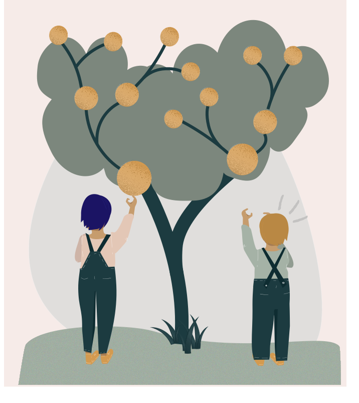
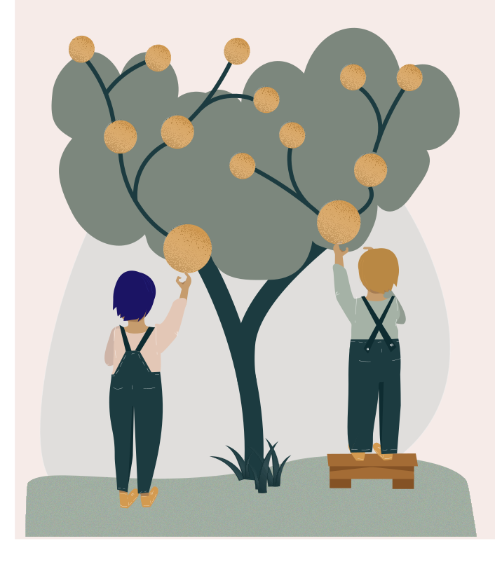
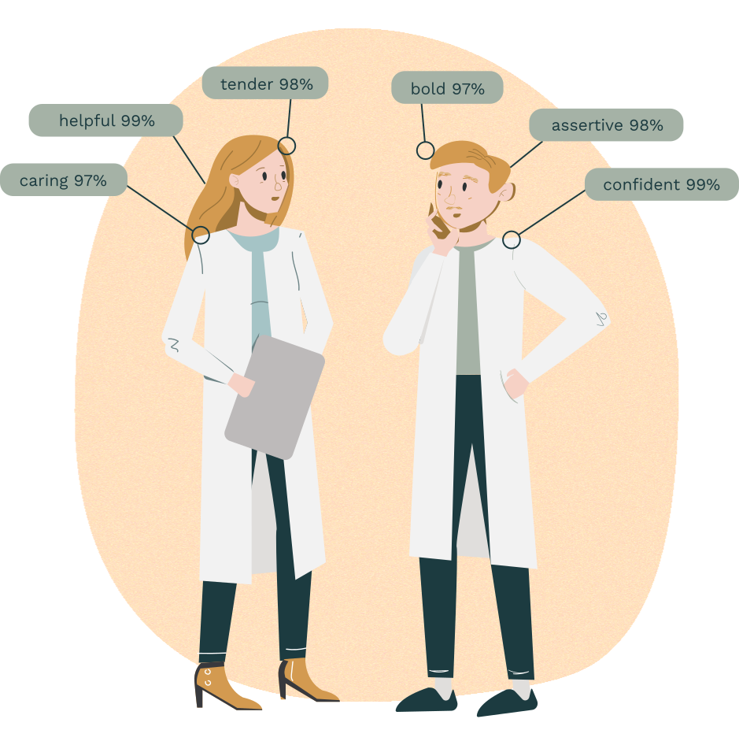

# Capítulo 6: Equidade — a IA deve ser justa e não discriminatória?

::: {.nota data-titulo="Sobre este capítulo"}
**Eixo:** Conceitos, Aplicações e Riscos

O que é justiça? O que distingue igualdade de equidade? Quando uma diferença de
tratamento se torna discriminação? Este capítulo examina os danos alocativos e
representacionais, as três origens do viés (*bias*) e por que ser justo não é
o mesmo que ser ético.
:::

## I. O que é justiça?

::: {.definicao data-titulo="Experimento mental: o algoritmo das notas"}
Para este experimento mental, suponhamos que, por causa da pandemia de
covid-19, todos os exames de conclusão do ensino médio finlandês tenham sido
cancelados. Em lugar do exame, seria preciso projetar e implementar um método
alternativo para determinar as notas de qualificação atribuídas aos estudantes
naquele ano. Como os estudantes são admitidos na universidade com base em suas
notas, as notas desses exames são extremamente importantes.

O governo decidiu que os professores dariam uma estimativa de como achavam que
seus alunos teriam se saído nos exames, e que isso determinaria as notas. Pediu-
se aos professores que fizessem avaliações de seus alunos.

Para combater a inflação de notas, foi usado um algoritmo que ponderava as
pontuações com base no desempenho histórico de cada escola. A ideia era que o
algoritmo compensasse a tendência dos professores a inflar o desempenho
esperado de seus alunos e que, assim, as estimativas previssem com mais
exatidão como os examinandos teriam de fato se saído. O algoritmo foi projetado
com duas informações: a posição do aluno dentro da escola e o desempenho
histórico da escola.

Como resultado, em nível nacional as notas corresponderam razoavelmente bem à
distribuição de notas dos anos anteriores. No entanto, o algoritmo rebaixou
quase 40% das notas previstas pelos professores. Os dados mostraram que os
resultados de estudantes de origem socioeconômica mais baixa foram rebaixados
com mais frequência do que os de origem socioeconômica mais alta. Para
estudantes de baixa renda que esperavam ir para a universidade, os resultados
foram devastadores.
:::

Muitos tomariam este experimento mental como exemplo de injustiça algorítmica.
Ele não descreve apenas como algoritmos podem, por si, produzir resultados
injustos, mas também como podem reforçar vieses econômicos e sociais já
existentes.

### Justiça e viés

Justiça e viés são provavelmente as questões éticas mais discutidas em relação
aos algoritmos contemporâneos. Por que são tão centrais?

* **Primeiro**, a justiça é elemento fundamental da estabilidade social. Como
  observa o filósofo John Rawls, a estabilidade de uma sociedade — ou de
  qualquer grupo — depende da medida em que seus membros sentem que estão sendo
  tratados de maneira justa. Quando alguns membros sentem que são tratados de
  modo injusto, isso costuma criar a base para inquietação social, distúrbios e
  conflito. As pessoas mantêm a unidade social apenas na medida em que suas
  instituições são justas.

* **Segundo**, como observou Immanuel Kant, os seres humanos têm a mesma
  dignidade. Em virtude dessa dignidade, têm direito a ser tratados como
  iguais. Se indivíduos são tratados injustamente — especialmente por motivos
  arbitrários —, sua dignidade humana fundamental é violada. Quando essa
  violação se efetiva em práticas, leva à discriminação.

Contudo, como ilustra o exemplo do algoritmo de inflação de notas, a justiça é
uma questão complexa. O algoritmo foi projetado para corrigir a inflação de
notas porque se julgava injusto que estudantes obtivessem vantagem indevida.
Como resultado, paradoxalmente, o algoritmo acabou reforçando vieses sociais já
existentes.

Neste capítulo, vamos nos concentrar em justiça, vieses e discriminação.
Abordaremos questões como: o que exatamente é justiça? A justiça deve consistir
em assegurar que todos tenham probabilidade igual de obter algum benefício? Ou
deve levar em conta as diferenças individuais e reconhecer a diversidade? E,
por fim: justiça e discriminação são sinônimos, ou significam coisas distintas?

## II. As variedades da justiça

Filósofos propuseram várias definições para o conceito de justiça. Segundo
Aristóteles, "os iguais devem ser tratados igualmente, e os desiguais,
desigualmente".

Esse **princípio da igualdade** afirma que os indivíduos devem ser tratados da
mesma forma, a menos que difiram de maneiras relevantes para a situação em que
estão envolvidos.

Por exemplo, se Alan Turing e Ada Lovelace obtiveram as mesmas notas nos exames
e não há diferenças relevantes entre eles ou entre os exames que prestaram,
então devem receber a mesma nota. E se Turing recebesse nota melhor do que
Lovelace simplesmente por ter status socioeconômico mais alto, isso seria
injusto. Por quê? Porque o status socioeconômico não deveria ser relevante na
atribuição de notas.

Contudo, o princípio da igualdade foi criticado por ser "cego". Ele não leva em
conta que nem todos partimos da mesma posição, nem que existem diferenças
individuais que importam. Em contraste com a igualdade, a "equidade" não
promove justiça tratando categoricamente todos do mesmo modo, e sim dando a
todos acesso igual às mesmas oportunidades. Há situações, por exemplo, em que a
diferença de origem socioeconômica é critério relevante para tratar as pessoas
de modo distinto. A maioria das pessoas considerou justo, por exemplo, que o
governo conceda benefícios sociais apenas aos cidadãos que realmente precisam,
e não a todos.

**Igualdade** significa que todos são tratados da mesma forma.

**Equidade** significa que cada um recebe o que precisa para ter sucesso.

Por outro lado, há também critérios que não são fundamentos justificáveis para
tratar pessoas de modo diferente. Em geral, consideramos injusto dar tratamento
especial a indivíduos com base em idade, sexo, raça ou preferências religiosas.
Em outras palavras: o que é discriminação?

::: {.nota data-titulo="Tipos de justiça"}
**Justiça distributiva** é a medida em que as instituições da sociedade
asseguram que benefícios e ônus sejam distribuídos entre seus membros de
maneira justa.

**Justiça retributiva** é a medida em que as punições são justas. Em geral, as
punições são consideradas justas na medida em que levam em conta critérios
relevantes, como a gravidade do crime e a intenção do criminoso, e descartam
critérios irrelevantes, como a raça.

**Justiça compensatória** é a medida em que as pessoas são justamente
compensadas por seus danos por aqueles que as prejudicaram; a compensação justa
é proporcional à perda infligida. É precisamente esse tipo de justiça que está
em jogo nos debates sobre danos à saúde de trabalhadores em minas de carvão.
Alguns argumentam que os donos das minas deveriam compensar os trabalhadores
cuja saúde foi arruinada. Outros argumentam que os trabalhadores assumiram
voluntariamente esse risco ao escolher o emprego nas minas.
:::

## III. Discriminação e vieses

Nesta seção estudaremos a discriminação e o modo como práticas discriminatórias
podem se manifestar por meio da inteligência artificial. O viés tornou-se
recentemente a questão prototípica da ética da IA, já que a esperança de que a
formalidade exata dos algoritmos os tornasse imunes à parcialidade revelou-se
dolorosamente falsa. Primeiro, veremos três exemplos de sistemas algorítmicos
que nos ajudarão a analisar discriminação e viés em IA.

#### Exemplo 1: *word embeddings* ([Bolukbasi et al.](https://arxiv.org/abs/1607.06520))

Vetores de palavras (*word embeddings*) são uma forma de estrutura de dados
usada em aplicações de processamento de linguagem natural (IA capaz de
compreender uma língua, como o inglês). São produzidos vasculhando textos e
registrando quais palavras ocorrem juntas com frequência. As associações
produzidas funcionam como uma espécie de dicionário para sistemas de IA,
capturando relações semânticas do tipo "homem" está para "rei" assim como
"mulher" está para "rainha". Bolukbasi et al. constataram que, sem grande
surpresa, esse tipo de associação tende a codificar relações conceituais
culturalmente disseminadas, mas consideradas discriminatórias. Por exemplo:
"mãe" está para "enfermeira" assim como "pai" está para "médico".

#### Exemplo 2: o algoritmo de recrutamento da Amazon ([Dastin, 2018](https://www.reuters.com/article/us-amazon-com-jobs-automation-insight/amazon-scraps-secret-ai-recruiting-tool-that-showed-bias-against-women-idUSKCN1MK08G))

Em 2014, a Amazon começou a desenvolver um sistema interno de IA para agilizar
seu processo de recrutamento. Usando os currículos de candidatos anteriores
como dados de treinamento, o sistema analisaria os currículos recebidos e
classificaria os candidatos para avaliação posterior. Muito rapidamente,
porém, descobriu-se que o sistema classificava candidatos a vagas técnicas de
maneira enviesada por gênero.

Constatou-se que o sistema penalizava currículos que indicassem que a candidata
era mulher. Isso incluía menções a coisas como participação em um clube
feminino de xadrez ou formação numa faculdade exclusivamente feminina. Segundo
relatos, a Amazon tentou remover o viés do sistema, mas acabou descartando o
projeto inteiro. O sistema nunca foi usado em processos reais de recrutamento.

#### Exemplo 3: pontuação de crédito ([Rutkenstein & Velkova, 2019](https://algorithmwatch.org/en/automating-society-2019/finland/))

Em 2018, o tribunal finlandês de não discriminação e igualdade julgou um caso
em que uma solicitação de crédito ao consumidor foi negada automaticamente por
métodos estatísticos. A instituição de crédito Svea Ekonomi avaliou
automaticamente a capacidade de crédito de um indivíduo no âmbito de sua compra
online de materiais de construção, para a qual ele buscava crédito. A decisão
foi contestada, e o tribunal concluiu que "a idade do solicitante, seu gênero
masculino, o finlandês como língua materna e a residência em área rural foram
todos fatores que contribuíram para um caso de discriminações múltiplas,
resultando na decisão de não conceder o empréstimo." O tribunal observou que,
se o solicitante fosse mulher ou falante de sueco, o crédito teria sido
concedido.

#### O que é discriminação?

Primeiro, é importante notar que a palavra discriminação pode ser usada num
sentido moralmente neutro ("você consegue discriminar entre estas duas cores?").
Ao longo desta seção, referimo-nos ao sentido moralmente carregado do termo.
Mas quando a discriminação é moralmente suspeita? Pode parecer uma pergunta
boba. Afinal, a maioria concordaria que temos um senso intuitivo bastante claro
do que seja discriminação. Ao ouvir o exemplo dos vetores de palavras acima, não
temos dificuldade em apontar a associação ofensiva e declarar: "isto é
discriminatório!" Colocar em palavras o que a torna discriminatória, contudo,
revela-se uma tarefa escorregadia. Comecemos, então, escrevendo nossas
intuições, e vejamos aonde isso leva:

::: {.definicao data-titulo="Definição 1: discriminação"}
Discriminação é uma diferença de tratamento de indivíduos com base em sua
pertença a um grupo.
:::

Como essa definição se sai ao capturar nosso senso de discriminação? As
palavras que fazem o trabalho aqui são "diferença" e "grupo". Ou seja, a
discriminação é algo comparativo, e as unidades de comparação são grupos
diferentes (ou, antes, agrupamentos), ou indivíduos que pertencem a eles. É um
bom começo, mas analisemos onde essa definição traça a linha. O que fica dentro
e o que fica de fora?

Considere, por exemplo, as carteiras de motorista. Na Finlândia, elas são
emitidas pela polícia mediante a conclusão de certa carga de treinamento
prático e teórico, além de um exame. Assim, as carteiras são emitidas com base
no mérito individual. Ainda assim, em geral achamos sensato que pessoas com
deficiência visual severa sejam excluídas do processo por completo, e não
consideramos isso discriminatório no sentido moral. Afinal, dirigir seria
praticamente impossível de qualquer modo. Precisamos, portanto, incluir algum
sentido de nocividade em nossa definição.

Considere, então, um café que só atende pessoas de camisa verde. Isso é
definitivamente tratamento diferenciado com base em pertencimento a um grupo, e
conduz a algum tipo de prejuízo, mas também não consideraríamos isso
discriminação em sentido moral. Poderíamos achar a política estranha, mas não
moralmente problemática. Assim, não é apenas o pertencimento a um grupo que nos
interessa, mas *quais* grupos.

::: {.definicao data-titulo="Definição 2: discriminação"}
Discriminação é tratamento diferenciado com base em pertencimento percebido a
um grupo socialmente saliente, que causa dano social
([Lippert-Rasmussen, 2014](https://oxford.universitypressscholarship.com/view/10.1093/acprof:oso/9780199796113.001.0001/acprof-9780199796113)).
:::

A "saliência social" é o que identifica quais características são moralmente
relevantes em casos de discriminação. Mas o que isso significa? Segundo
Lippert-Rasmussen, uma característica é socialmente saliente se for importante
para a estrutura das interações sociais em múltiplos contextos. Ou seja, o que
se considera classificação socialmente saliente é uma questão historicamente
contingente: numa linha temporal alternativa, em que usar camisa verde fosse
invariavelmente questão de importância social, influindo no tipo de dignidade,
oportunidades ou status conferidos a uma pessoa (se fosse vestimenta religiosa,
por exemplo), o caso do café acima poderia perfeitamente contar como
discriminação.

Reconhecer a discriminação em sentido moral não é, portanto, simplesmente
reconhecer discrepâncias de tratamento entre agrupamentos arbitrários. Exige,
antes, contextualizar o tratamento desigual na história das práticas opressivas
ou valorativas da sociedade e nos agrupamentos que ela torna salientes. Por
exemplo, a Carta dos Direitos Fundamentais da União Europeia lista as seguintes
características como moralmente pertinentes em casos de discriminação: sexo,
raça, cor, origem étnica ou social, características genéticas, língua, religião
ou convicções, opiniões políticas ou outras, pertença a uma minoria nacional,
propriedade, nascimento, deficiência, idade e orientação sexual.

### Os danos — o que são?

Refletindo sobre os dois exemplos acima, a condição de saliência social está
claramente satisfeita em ambos. Gênero é uma categoria que historicamente
sempre estruturou a interação social. E quanto ao dano? Um caso é mais claro
que o outro: perder uma oportunidade de emprego por razões alheias à adequação
ao cargo é claramente um dano. No caso dos vetores de palavras, qualquer dano
que ocorra é mais difícil de localizar. Ao menos, não conseguimos apontar
diretamente uma oportunidade perdida, um serviço recusado ou um bem negado.
Ainda assim, em casos assim um dano é instaurado. Para captá-lo, precisamos
compreender a diferença entre danos **alocativos** e **representacionais**,
como apresentados em [Crawford, 2017](https://www.youtube.com/watch?v=fMym_BKWQzk).

#### Danos alocativos

Danos alocativos são situações em que um indivíduo fica em pior situação quanto
aos recursos disponíveis para ele. Aqui, "recursos" devem ser entendidos
amplamente: não apenas comida, carros, celulares e outros bens materiais, mas
também os serviços e as oportunidades oferecidos. Um salário menor pelo mesmo
trabalho é definitivamente um dano alocativo. Mas também o é negar a
oportunidade de uma entrevista de emprego com base no gênero, ou negar crédito
com base nele.

Até abstrações como o risco podem ser objeto de danos alocativos.
[Wilson, Hoffman e Morgenstern (2019)](http://arxiv.org/abs/1902.11097)
constataram que algoritmos de detecção de objetos são piores em reconhecer
figuras de tom de pele escuro do que de tom claro. As pesquisadoras Joy
Buolamwini e Timnit Gebru também mostraram que algoritmos de reconhecimento
facial são notavelmente piores em reconhecer rostos de pessoas racializadas
([Buolamwini e Gebru, 2018](http://proceedings.mlr.press/v81/buolamwini18a/buolamwini18a.pdf)).
Isso significa que carros autônomos podem ter mais probabilidade de atropelar
uma pessoa negra do que uma branca. Ora, dado que causar dano corporal é
claramente um dano, pode-se argumentar que um dano já ocorreu mesmo antes de
tais acidentes acontecerem: a distribuição desigual do risco é, ela própria, um
dano alocativo à parte prejudicada.

#### Danos representacionais

Danos representacionais são aqueles que não dizem respeito à distribuição de
bens, e sim à representação de grupos e indivíduos. Essa classe inclui danos
como denegrição, estereotipagem, falha de reconhecimento (*misrecognition*) e
*exnominação*. Exnominação é um termo originado dos estudos de mídia e designa
a prática pela qual certa categoria ou modo de ser é enquadrado como norma por
não receber nome, ou por não ser especificado como categoria em si (por
exemplo, "atleta" *vs.* "atleta feminina").

Danos representacionais afetam as narrativas que construímos sobre os grupos
sociais relevantes. Ao amplificar visões estereotipadas, degradar o status
social de indivíduos e enquadrar certos modos de ser como o padrão, os danos
representacionais fabricam as justificativas infundadas para práticas
opressivas.

Com o conceito de danos representacionais, somos capazes de identificar as
associações de palavras enviesadas por gênero como discriminatórias, ainda que
elas próprias não sejam um exemplo de distribuição de recursos no sentido dos
danos alocativos.

### Como o viés surge?

> *"Todo dado é dado histórico: produto de um tempo, de um lugar, de um clima
> político, econômico, técnico e social. Se você não está considerando por que
> seus dados existem, e por que outros conjuntos de dados não existem, você
> está fazendo ciência de dados errado."*
>
> <cite>[Melissa Terras (2019)](https://www.youtube.com/watch?v=4yYytLUViI4)</cite>

::: {.definicao data-titulo="Três sentidos de \"viés\""}
Na **estatística**: discrepância entre a estatística de uma amostra e a
estatística verdadeira da população.

Na **ciência cognitiva**: um modo de raciocínio que provavelmente produz
resultado incorreto ou distorcido.

Na **justiça social**: uma discrepância moralmente suspeita no tratamento de
pessoas.
:::

Até aqui conseguimos encontrar uma definição razoável de discriminação e temos
ao menos dois exemplos concretos de sistemas de IA participando dela. Em ambos,
a prática discriminatória decorre de vieses no próprio sistema. Portanto, se
quisermos lidar com a questão, temos algumas perguntas a responder. Como
sistemas de IA se tornam enviesados? Como podemos medir se um sistema é
enviesado? Como podemos corrigi-lo?

Nesta seção, veremos como práticas discriminatórias se retroalimentam. Ou seja,
uma IA enviesada não é apenas uma questão técnica, mas resultado de uma história
de práticas sociais. Podemos detectar quando nossos sistemas amplificam essas
tendências discriminatórias e, melhor ainda, como podemos interromper o ciclo?
Veremos três maneiras pelas quais o viés entra num sistema:

#### 1) Amostra não representativa

O modo mais evidente pelo qual o viés entra num sistema é por um conjunto de
dados não representativo. Ou seja, os dados que alimentam o sistema de
aprendizado não são um retrato fiel do mundo em geral. Não surpreende que, ao
manipular o modo como o aprendiz vê o mundo — amplificando algumas instâncias
de fenômenos e suprimindo outras —, o sistema aprenda um modelo distorcido.

Por exemplo, a capacidade de reconhecer pessoas é distribuída desigualmente
entre grupos étnicos em muitos sistemas de reconhecimento facial. O resultado é
que o sistema de classificação de imagens do Google, por exemplo, chegou a
rotular pessoas negras como gorilas
([Kasperkevic, 2015](https://www.theguardian.com/technology/2015/jul/01/google-sorry-racist-auto-tag-photo-app)).

Uma razão para isso, segundo
[Buolamwini e Gebru (2018)](http://proceedings.mlr.press/v81/buolamwini18a/buolamwini18a.pdf),
é que muitos conjuntos de dados populares de rostos têm distribuição muito
pobre de exemplos entre diferentes gêneros e etnias. Ou seja, a visão dos
rostos do mundo fornecida aos sistemas de aprendizado é inegavelmente branca e
masculina, e muito pouco representativa da verdadeira distribuição de rostos no
mundo. Às vezes isso é tecnicamente chamado de disparidade de tamanho amostral,
e leva a sistemas enviesados porque o algoritmo de aprendizado despreza
subpopulações mal representadas para alcançar maior capacidade preditiva sobre
a maioria do conjunto de dados.

#### 2) Viés de rótulo

"Deixe os dados falarem por si", diz o ditado. É um bom pensamento, mas a
verdade infeliz é que os dados não têm voz própria. Os dados só falam por meio
de nossas interpretações — e com frequência essas interpretações são difíceis
de fazer. Isso é especialmente verdadeiro em situações em que há discrepância
entre o que está sendo medido e o que está sendo investigado.

Por exemplo, prever crimes é uma tarefa que, se bem-feita, interessaria a
tribunais, polícias e cidadãos igualmente. Infelizmente, crime é algo difícil de
medir e, portanto, bons conjuntos de dados são difíceis de produzir. O que
conseguimos medir são coisas a que temos acesso informacional, como prisões e
condenações. A esperança é que esses substitutos (*proxies*) se correlacionem
bem com a quantidade de crime numa população. Além disso, deveríamos desejar
que se correlacionem igualmente bem entre grupos socialmente salientes dentro
dela.

A verdade infeliz é que prisões dificilmente são um substituto neutro para
crime. Podem dar boa noção do crime geral numa população, mas não se
generalizam bem entre agrupamentos. Nos Estados Unidos, pessoas negras podem
ter probabilidade muito maior de serem presas por acusações relacionadas a
drogas do que pessoas brancas
([Ferrer & Connolly, 2018](https://www.ncbi.nlm.nih.gov/pmc/articles/PMC6050822/)),
por exemplo. Isso não significa que pessoas negras tenham mais probabilidade de
cometer crimes de drogas, apenas que têm mais probabilidade de serem
flagradas, presas e registradas fazendo isso. Assim, quaisquer inferências
sobre crime a partir desses dados necessariamente repetirão e reforçarão as
injustiças que produziram os próprios dados.

#### 3) Desconhecimento cultural

Embora "IA" e "aprendizado de máquina" (*machine learning*) evoquem uma imagem
de autonomia maquínica, na realidade grande quantidade de trabalho — trabalho
humano — é necessária para tornar sistemas de IA reais. Assim, o comportamento
de sistemas de IA não pode ser compreendido olhando apenas para o algoritmo e
para os dados
que entram nele. Escolhas são feitas no trabalho de implantação, interpretação,
projeto e manutenção envolvido na IA, e às vezes essas escolhas criam vieses no
sistema.

Um dos exemplos mais claros disso está nos modos pelos quais os dados são
"limpos", envolvendo decisões sobre o que é sinal real em oposição a ruído
incômodo. Essa é uma tarefa por vezes vista como faxina e, portanto, como algo
que não faz parte do núcleo do negócio da IA — e acontece despercebida em
muitas etapas do processo. Por exemplo, ao coletar dados em formulários web,
chama-se sanitização de entrada.

::: {.tecnica data-titulo="O problema dos nomes"}
Um bom exemplo é a coleta de nomes. Para impedir que dados falsos entrem no
sistema, criam-se certas restrições sobre como os nomes devem ser. Por exemplo,
às vezes se supõe que nomes consistem em prenomes e um sobrenome. Às vezes se
supõe que nomes contêm apenas letras de A a Z. Às vezes se supõe que nomes
sempre têm mais de duas letras.

Essas podem ser suposições razoáveis no contexto cultural limitado dos
projetistas e programadores, mas na realidade os nomes são extremamente
diversos. Nenhuma forma universal de nome pode realmente ser dada e, se alguém
quiser ser verdadeiramente inclusivo, todos os campos de nome em formulários
web deveriam ser caixas de texto de comprimento arbitrário que aceitem qualquer
tipo de caractere. Sem compreensão cultural diversa, o sistema pode ser
projetado, sem intenção, de modo a deixar de fora grandes grupos de pessoas que
não se enquadram nos padrões culturais dominantes.
:::

O viés pode, portanto, entrar num sistema de muitas maneiras diferentes, e as
acima são apenas alguns exemplos dos mecanismos em jogo. O ponto importante
aqui é que, ao analisar sistemas de IA em busca de injustiça, não basta olhar
para os algoritmos. A injustiça pode surgir por razões históricas, culturais, de
projeto, de gestão de dados ou de implantação — e, portanto, todo o processo de
desenvolvimento de IA deve estar sob escrutínio.

## IV. Removendo o viés

Como, então, tornamos sistemas de IA mais justos e menos enviesados? Não há
panaceia para o viés — em parte por causa das muitas formas pelas quais ele
pode se manifestar, em parte porque não existe uma definição única de resultado
algoritmicamente justo. Ainda assim, podemos examinar algumas das situações
acima e pensar em como os problemas de justiça poderiam potencialmente ter sido
tratados.

Começando pelo exemplo do algoritmo sexista de recrutamento, podemos localizar
a origem do viés nas práticas históricas de recrutamento que produziram os
dados de treinamento, e na suposição de que práticas passadas fornecem base
normativa para práticas futuras (isto é: "devemos contratar esta pessoa porque
já contratamos pessoas como ela antes"). Vemos que as questões de fundo estão
inexoravelmente ligadas à cultura da empresa e até à cultura de trabalho mais
ampla do setor de tecnologia, bem como a um raciocínio moralmente suspeito
(lembre-se da guilhotina de Hume, no capítulo 1). São problemas que exigem
grandes deslocamentos culturais e reformas estruturais, e é improvável que
sejam resolvidos por soluções tecnológicas.

#### Anticlassificação

Ainda assim, poder-se-ia tentar salvar o que for possível do conjunto de dados
e ver se ele poderia ficar ao menos menos enviesado. Um conserto técnico comum
sobre o conjunto de dados chama-se anticlassificação, ou remoção explícita das
variáveis protegidas. Isso significa apagar informações como gênero ou etnia, e
seus substitutos, dos dados. Aqui, substitutos são características fortemente
correlacionadas com as características protegidas. Como no caso do algoritmo de
recrutamento mencionado antes, se o currículo de uma pessoa contém referências
a licença-maternidade ou a uma faculdade feminina, o algoritmo ainda poderia
fazer previsões marcadas por gênero mesmo que a variável explícita de gênero
seja omitida.

Isso pode contribuir em certa medida para reduzir o viés no sistema, mas se é
eficaz em algum cenário específico precisa ser verificado por testes e
auditoria. Corbett-Davies e Goel (2018) mostraram que a anticlassificação pode
até ser prejudicial à justiça em certas situações, nas quais características
têm poder preditivo diferente entre grupos sociais. Uma ilustração são os
sintomas de infarto: pesquisas mostraram que infartos se apresentam de modo
muito diferente em pacientes mulheres e homens. Os sintomas que a maioria sabe
procurar, por exemplo dor torácica do lado direito, são muito mais comuns em
pacientes homens do que mulheres. Assim, um aplicativo em que se pudesse
verificar "estou tendo um infarto?" provavelmente daria resultados muito
errados se não levasse em conta o sexo do paciente.

#### Reamostragem

Em casos como o do algoritmo de reconhecimento facial pesquisado por Buolamwini
e Gebru, em que o viés é produzido por disparidade de tamanho amostral, a
reamostragem é uma forma possível de abordar o problema. Isso pode significar
usar apenas uma porção menor do conjunto de dados, que tenha melhor
distribuição de exemplos entre todos os agrupamentos sociais relevantes. Outra
forma de reamostrar é produzir exemplos sintéticos dos grupos sub-representados
(Chawla et al., 2002). Novamente, se isso funciona é questão de verificação
caso a caso. Pode ser que o conjunto de dados esteja tão desequilibrado que não
haja como corrigi-lo, a não ser criando um novo do zero. Além disso, num caso
tão sensível e de alto risco como o reconhecimento facial, não é dado que o
sistema será ético, justo e não discriminatório mesmo que a classificação seja
não enviesada e o conjunto de dados igualmente representativo. Abordaremos isso
na próxima seção mas, em termos de tornar a IA justa, às vezes a única maneira
de fazê-lo é não desenvolver aquela IA em primeiro lugar.

#### Discriminação para além do viés

O importante a lembrar aqui é que discriminação não é o mesmo que viés
sistemático. O viés em sistemas de IA é causa bastante evidente de práticas
discriminatórias e, por sua natureza quantificável, encaixa-se facilmente no
mundo conceitual da pesquisa técnica em IA. Talvez seja por isso que o salto
conceitual da discriminação para o viés seja feito com tanta frequência.

Ainda assim, sistemas de IA podem participar de práticas discriminatórias que
não decorrem de viés no próprio sistema. Precisamos, antes, expandir nosso
objeto de investigação das minúcias do modelo de IA para todo o sistema de
instituições do qual ele participa.

::: {.nota data-titulo="Quando o problema não é a acurácia"}
No início de 2018, pesquisadores da Stanford Graduate School of Business
publicaram um artigo detalhando um sistema de aprendizado profundo
(*deep learning*) capaz de distinguir entre homens gays e heterossexuais com
acurácia de 81% a partir de uma única foto do rosto. Os achados foram
controversos, no mínimo, e por muitas razões diferentes. Críticos levantaram
preocupações sobre a ressurreição da
pseudociência da fisiognomia, que tem conexão profundamente enraizada com
injustiças racistas históricas. Houve também suspeitas de que o sistema, em vez
de captar sutis marcadores genéticos como se alegava, na verdade estivesse
rastreando o modo como as pessoas tendem a se arrumar e a tirar fotos de si
mesmas.

Além disso, esse sistema de IA opera claramente numa área eticamente nebulosa
quanto a privacidade, autodeterminação e, evidentemente, discriminação. Deixando
de lado as outras preocupações por ora, como a discriminação funciona aqui?
Claramente o viés de classificação não é o elemento discriminatório: não é
eticamente relevante para nós se o estimador é mais acurado em prever
homossexualidade em alguns grupos do que em outros. A característica eticamente
relevante do sistema é que, independentemente de sua acurácia, ele possibilita
diretamente tratamento diferenciado com base em agrupamento social percebido.
:::

Não é preciso detalhar exemplos de usos maliciosos de sistemas como o descrito
acima, pois sua possibilidade deve ser óbvia a todos. Deixando de lado os usos
diretamente maliciosos, podemos imaginar a integração de tal tecnologia, por
exemplo, à maquinaria de publicidade personalizada online composta por redes
sociais, processadores de dados, influenciadores de tendências e comerciantes
globais. Mesmo que a IA classificadora seja, por todos os padrões técnicos,
justa e não enviesada, ela condiciona a publicidade online de bens ao princípio
discriminatório de que a orientação sexual presumida é razão válida para tratar
pessoas de modo diferente.

Isso nos leva a um ponto importante para quem considera a ética dos sistemas de
IA: cuidado com a armadilha do reducionismo! Ou seja, devemos evitar reduzir o
conceito de ética a valores simplificados, quantificados e de atalho, como
"ausência de viés". Como sistemas de IA participam de processos muito mais
complexos do que aquilo que o próprio sistema faz, a ética não pode ser medida
apenas olhando os valores de entrada e de saída do algoritmo.

Em suma: **justo não significa ético**.

::: {.reflexao data-titulo="Exercícios desta seção"}
O material original traz aqui dois questionários interativos. As perguntas não
constam do repositório de origem — ficam no banco de dados da plataforma. Os
exercícios correspondentes devem ser redigidos em
`exercicios/capitulo06-exercicios.md`.
:::

## Referências

Bolukbasi, T., Chang, K.-W., Zou, J., Saligrama, V., & Kalai, A. (2016). Man is
to Computer Programmer as Woman is to Homemaker? Debiasing Word Embeddings.
<https://arxiv.org/abs/1607.06520>

Buolamwini, J., & Gebru, T. (2018). Gender Shades: Intersectional Accuracy
Disparities in Commercial Gender Classification. *PMLR* 81.
<http://proceedings.mlr.press/v81/buolamwini18a/buolamwini18a.pdf>

Chawla, N. V., et al. (2002). SMOTE: Synthetic Minority Over-sampling
Technique.

Corbett-Davies, S., & Goel, S. (2018). The Measure and Mismeasure of Fairness.

Crawford, K. (2017). The Trouble with Bias. *NIPS 2017 Keynote*.

Dastin, J. (2018). Amazon scraps secret AI recruiting tool that showed bias
against women. *Reuters*.

Ferrer, B., & Connolly, J. M. (2018). Racial Inequities in Drug Arrests.

Kasperkevic, J. (2015). Google says sorry for racist auto-tag in photo app.
*The Guardian*.

Lippert-Rasmussen, K. (2014). *Born Free and Equal?* Oxford University Press.

Rawls, J. (1971). *A Theory of Justice*. Harvard University Press.

Rutkenstein, M., & Velkova, J. (2019). Automating Society: Finland.
*AlgorithmWatch*.

Terras, M. (2019). Palestra. <https://www.youtube.com/watch?v=4yYytLUViI4>

Wilson, B., Hoffman, J., & Morgenstern, J. (2019). Predictive Inequity in
Object Detection. <http://arxiv.org/abs/1902.11097>

---

::: licenca
**Material original:** *Ethics of AI*, um curso online gratuito da
Universidade de Helsinque. Professores responsáveis: Anna-Mari Rusanen e
Jukka K. Nurminen. Demais contribuintes principais: Santeri Räisänen, Sasu
Tarkoma e Saara Halmetoja. Disponível em <https://ethics-of-ai.mooc.fi/>.

**Esta versão:** tradução e adaptação para o português brasileiro realizada
por José Lucas Lira Bizil, Fernando Mazzeto Lisboa Lima e Matheus da Silva Fernandes, no âmbito do Programa CiberExt 26-29 (FEELT38103),
Universidade Federal de Uberlândia, 2026. Esta é uma obra derivada; os autores
originais não a revisaram nem a endossam.

**Licença:** Creative Commons Atribuição-NãoComercial-CompartilhaIgual 4.0
Internacional (CC BY-NC-SA 4.0) —
<https://creativecommons.org/licenses/by-nc-sa/4.0/deed.pt-br>.
:::
